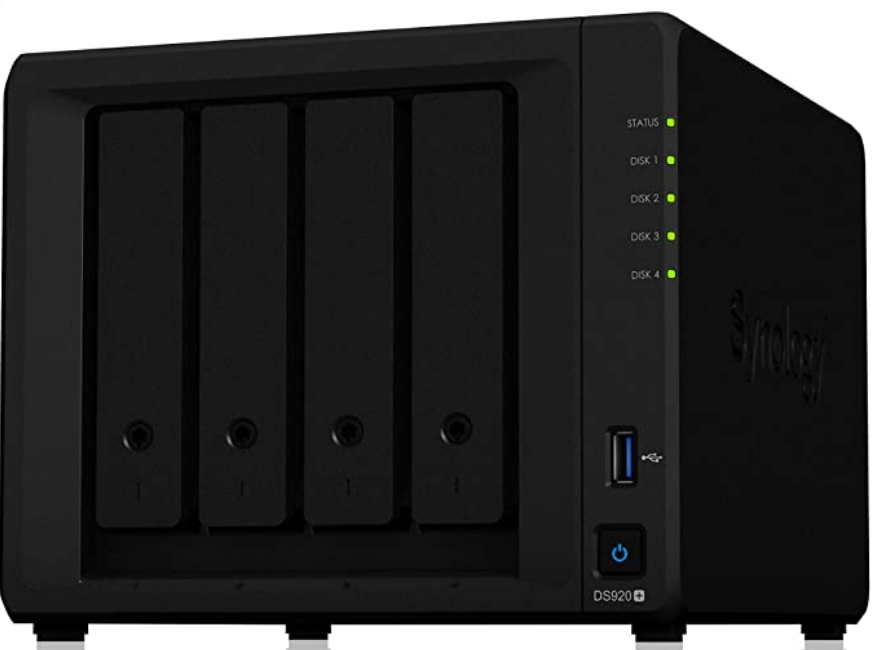
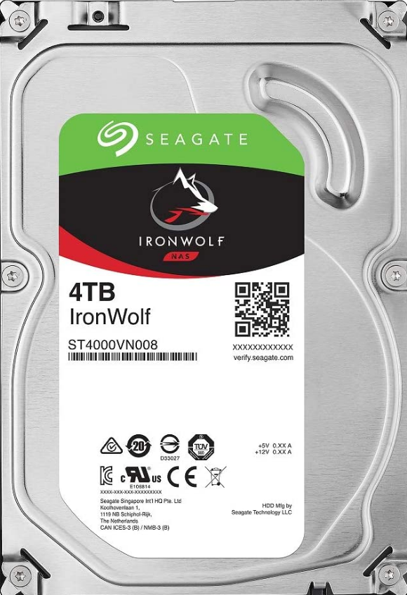
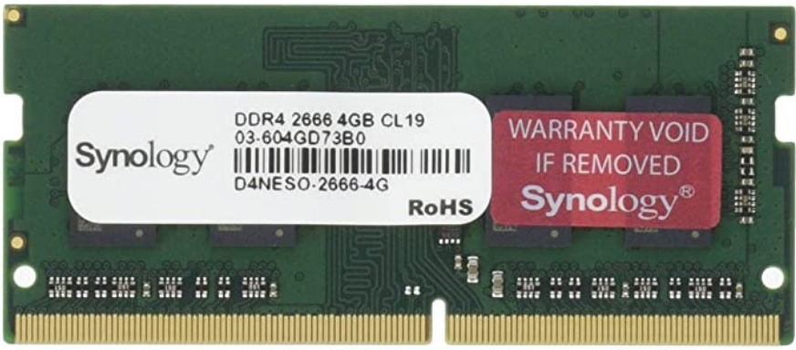
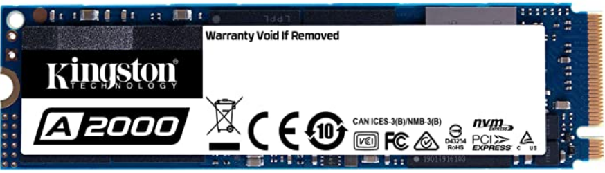
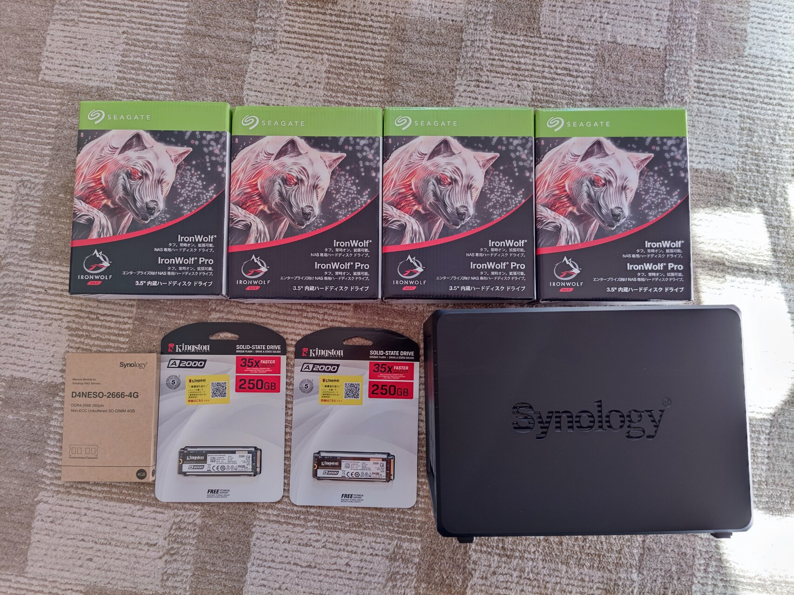

# NAS的选购

## 品牌
基于安全性和使用简单的考虑，选择了群晖。  
想实现大容量硬盘存储并且有一定的容错能力，所以选择了4盘的NAS，
这样可以构建RAID5，实现牺牲一个盘的容量，提供一个硬盘损坏时的容错能力。

后来我发现群晖提供一个SHR的磁盘阵列模式，能够比RAID5更有效的利用磁盘空间，更坚定了我买群晖意向。  
至于SHR比RAID5好在哪儿，可以通话下面的网站计算容错和硬盘空间，比一比就知道了。  
https://www.synology.com/en-us/support/RAID_calculator

最终决定买了群晖DS920+。

https://www.amazon.co.jp/gp/product/B087Z34F3R/ref=ppx_yo_dt_b_asin_title_o02_s01?ie=UTF8&psc=1

## 硬盘
处于经济考虑，选择了四块4TB的硬盘，另外考虑到抗损坏能力，买了NAS专用的硬盘。  

https://www.amazon.co.jp/gp/product/B01LX922U0/ref=ppx_yo_dt_b_asin_title_o02_s00?ie=UTF8&psc=1

## 配件
### 内存
想通过Docker安装扩展功能，Docker是很吃内存的。实际使用下来也确实如我所预测。  
看电影时内存会保持在40%左右，如果没有加一条8GB的内存，内存使用率会是80%以上，很可能就很慢了。

内存选择了群晖原装的内存，贵是贵了点，不过保存的数据是无价的，所以还是决定买原装货。  
另外如果不用原装的话，群晖是不提供售后服务的。  

https://www.amazon.co.jp/gp/product/B07X5MMGWG/ref=ppx_yo_dt_b_asin_title_o02_s00?ie=UTF8&psc=1

安装硬盘之前，把硬盘架子都拿出来，在最深处可以发现内存插口。

## SSD缓存
使用缓存可以一定程度上提高硬盘存取的速度，另外避免的频繁的硬盘操作，对提高硬盘寿命也有帮助。  

在群晖NAS的底部，有两个SSD缓存插槽，不需要螺丝，很容易安装。  

https://www.amazon.co.jp/gp/product/B07VYG5HQD/ref=ppx_yo_dt_b_asin_title_o02_s00?ie=UTF8&psc=1

## 全家福
