# 媒体服务器

## 选择
主要的媒体服务器有PLEX，emby，jellyfin三款。  
前两个要收费，最后一个是完全免费开源的。  
我也没发现前两个到底好在哪儿，所以就选用了免费的jellyfin。

另外群晖自带一个Video Station的媒体服务器，但是它不支持DTS音频，如果要支持的也要自己设定很多东西，  
感觉比较麻烦就没有整。其实jellyfin也比较麻烦，不过麻烦没必要两次，所以就决定只用jellyfin了。

## jellyfin的构建
### 安装Docker
在套件中心搜索docker安装。
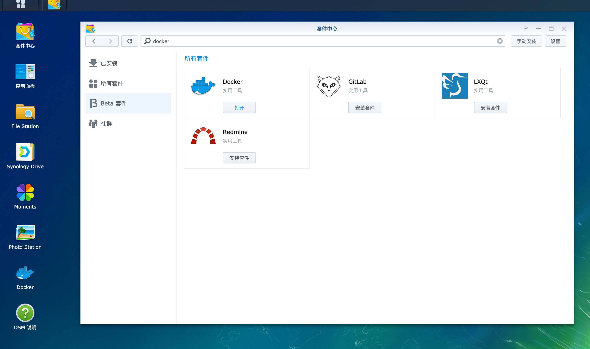

### 下载jellyfin镜像
双击`jellyfin/jellyfin`选择最新版下载。
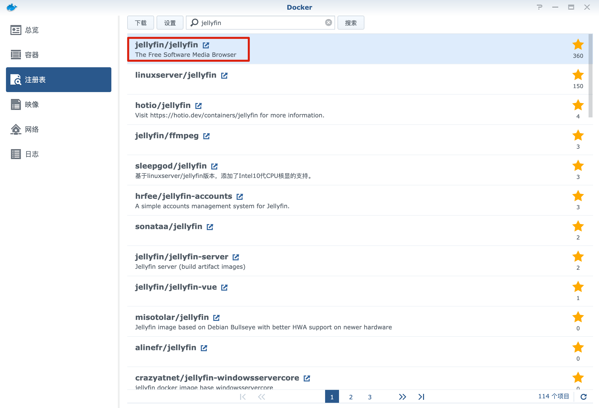

### 创建jellyfin docker container
打开群晖的ssh功能。
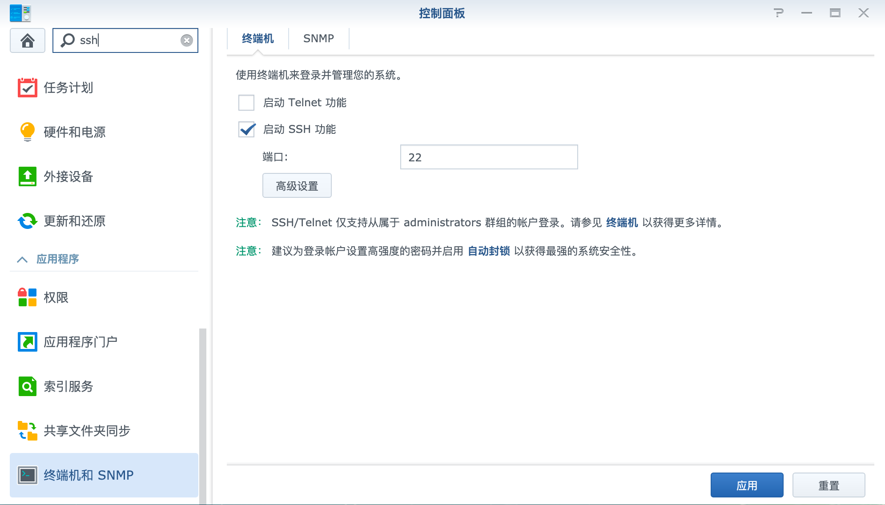

登入NAS后，输入如下命令获取root权限
```
sudo -I
```

建立jellyfin所需文件夹
```
mkdir -p /volume1/docker/jellyfin/config
mkdir -p /volume1/docker/jellyfin/cache
mkdir -p /volume1/docker/jellyfin/fix_font
```

创建docker container
```
docker run -d -p 8096:8096 --restart=always --name jellyfin -v /volume1/docker/jellyfin/config:/config  -v /volume1/docker/jellyfin/cache:/cache -v /volume1/video:/media -v /volume1/av:/av -v /volume1/docker/jellyfin/fix_font:/fix_font --device=/dev/dri/renderD128 --device /dev/dri/card0:/dev/dri/card0 jellyfin/jellyfin:latest
```

### 解决ASS字幕方块的问题
将fix_font.zip解压缩后拷贝到`/volume1/docker/jellyfin/fix_font`中。

进入jellyfin docker container的命令行


执行下列命令
```
cp /fix_font/FZZY_GBK.woff2 /jellyfin/jellyfin-web/libraries/
cp /fix_font/plugin.js /jellyfin/jellyfin-web/plugins/htmlVideoPlayer/
```

### jellyfin服务的访问
http://你的NAS的IP:8096

## Emby的构建
由于不想自己整理各种影视信息，所以决定使用下面的谷歌共享盘。  
而使用这个谷歌共享盘后有很多SUBRIP的字幕文件，jellyfin无法很好的支持这种格式的字幕，  
所以选择了Emby。

### 下载Emby的Docker Image
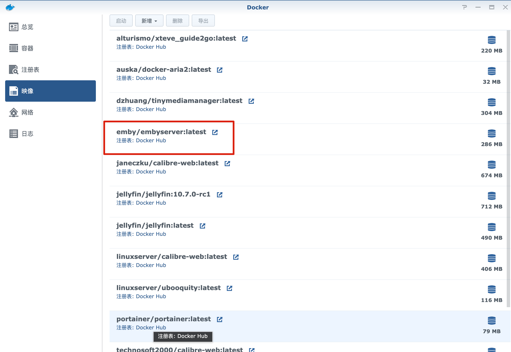

### 建立所需文件夹
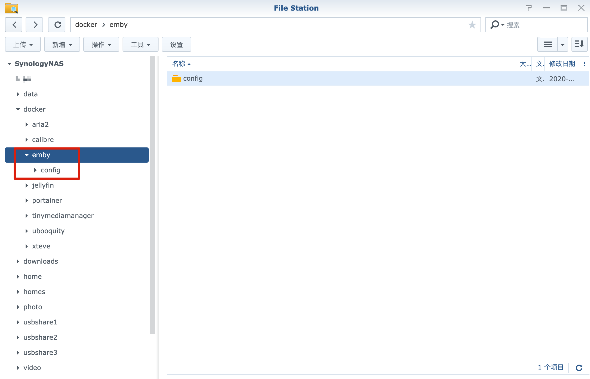

### 创建docker container
通过SSH连接到群晖。
```
sudo -i
```
得到root权限，执行下列代码创建docker container。
```
chmod a+x /dev/dri
docker create --name=emby --device /dev/dri:/dev/dri emby/embyserver:latest
```
端口和环境变量设定  
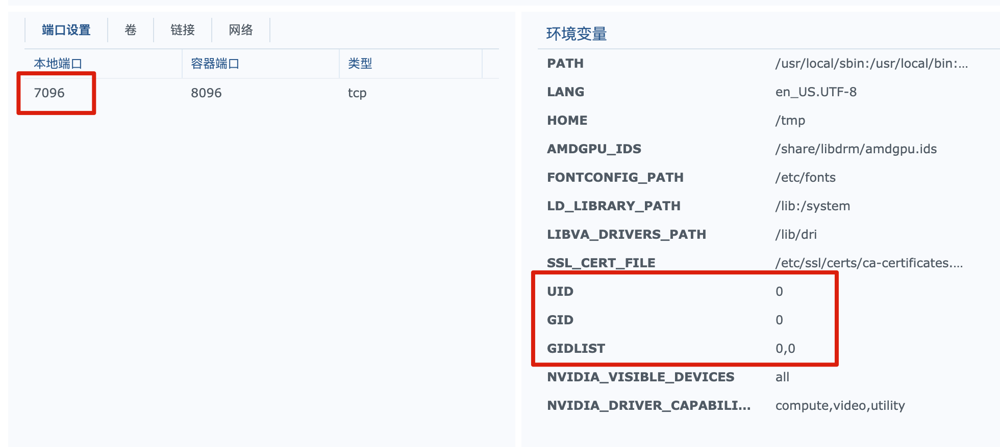

文件夹映射设定  
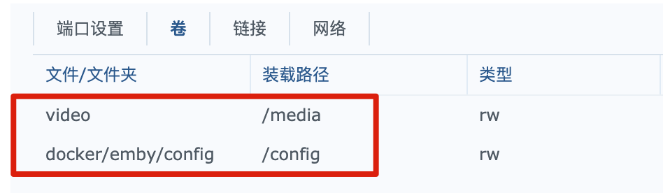

Check自动重新启动
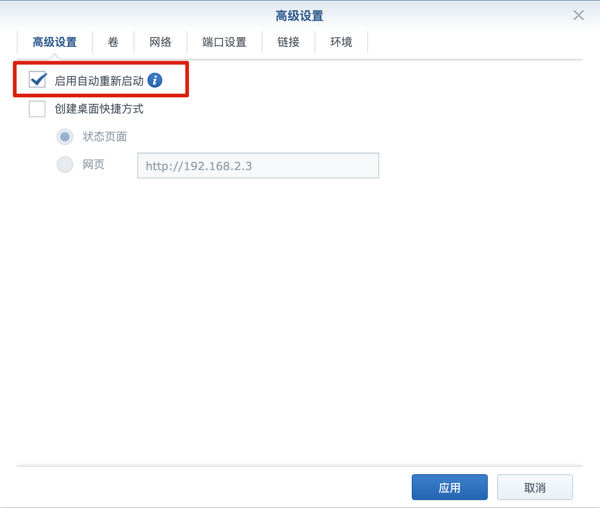

启动后可以确认container已经启动
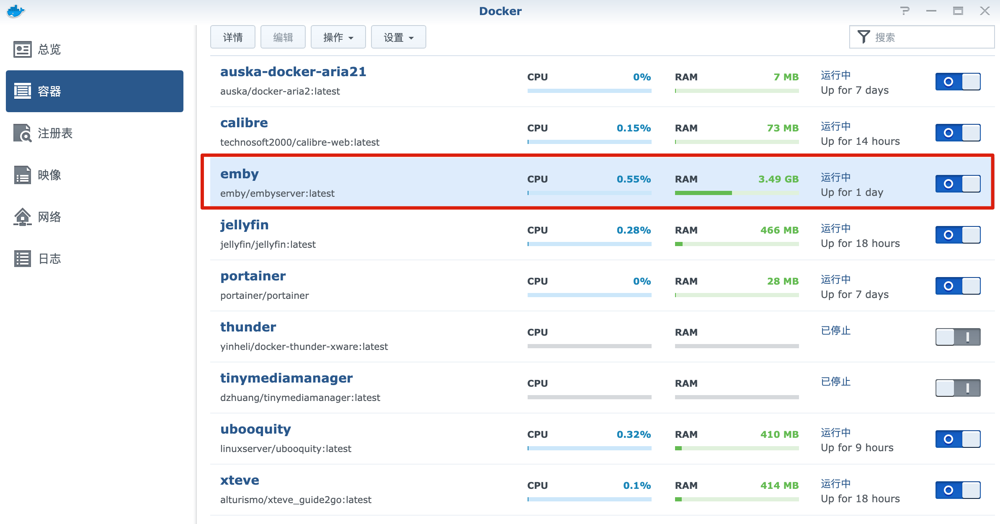

### Emby的访问URL
http://你的NAS的ip:7096

## Emby服务端设定
暂时省略

## 精英盘挂载方法
通过[https://gayufan.com/](https://gayufan.com/)购买精英盘使用权后，你的GoogleDrive的共享文件夹下会出现精英盘。

然后按照下面的教程进行设置。
https://www.v2rayssr.com/embygoogledrive.html

### 一些和教程中不一样的地方
1. rclone的安装并不需要root。
在自己的用户下安装并进行`rclone config`后，设定文件会生成在`~/.config/rclone/rclone.conf`。
1. 由于是docker安装的emby，所以没有emby的用户，所以对`embyserver`进行的权限修改是不需要的。
1. 由于不是root而是用自己的用户安装的rclone，所以rcloned放置的地方不是`/root/rcloned`，而是`/var/services/homes/你的用户名/rcloned`。
1. 不要使用`rclone mount gdnf:/ /volume1/GDNF --allow-other --allow-non-empty --vfs-cache-mode writes &`进行挂载，而要使用`rcloned start`进行挂载。
1. 计划任务的执行用户不是root，而是你的用户名。
1. 由于精英盘有访问次数的限制，有时候别的用户访问多了，也会导致你无法访问了。会出现如下错误。
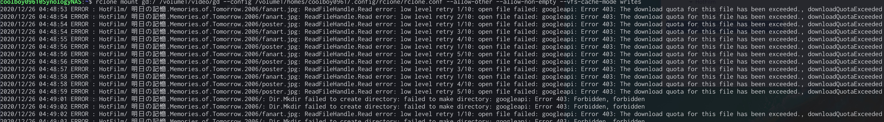  
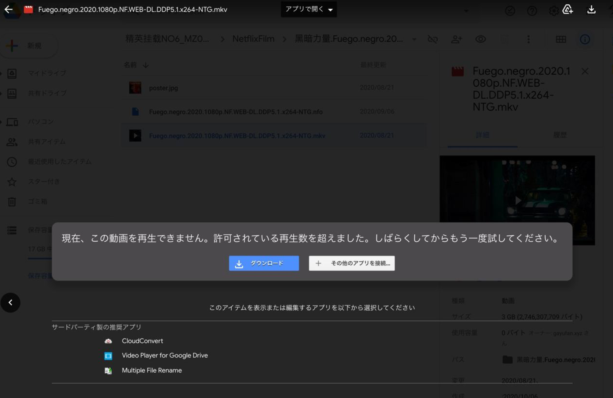  
目前没有特别好的解决方法，我管客服又要了一个精英盘，当一个不能访问后我就重新挂载另一个，有些麻烦。  

