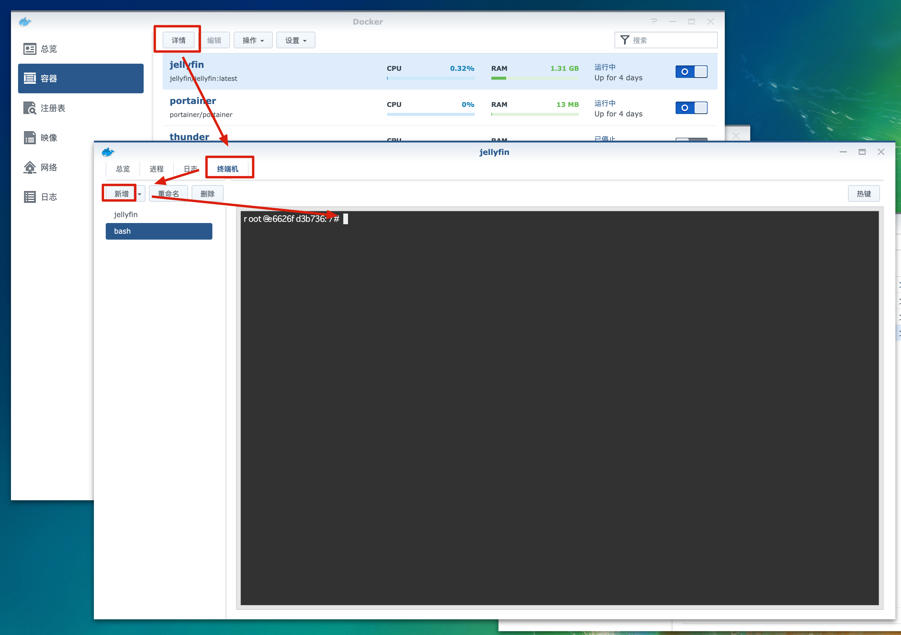

# 媒体服务器

## 选择
主要的媒体服务器有PLEX，emby，jellyfin三款。  
前两个要收费，最后一个是完全免费开源的。  
我也没发现前两个到底好在哪儿，所以就选用了免费的jellyfin。

另外群晖自带一个Video Station的媒体服务器，但是它不支持DTS音频，如果要支持的也要自己设定很多东西，  
感觉比较麻烦就没有整。其实jellyfin也比较麻烦，不过麻烦没必要两次，所以就决定只用jellyfin了。

## jellyfin的构建
### 安装Docker
在套件中心搜索docker安装。


### 下载jellyfin镜像
双击`jellyfin/jellyfin`选择最新版下载。


### 创建jellyfin docker container
打开群晖的ssh功能。


登入NAS后，输入如下命令获取root权限
```
sudo -I
```

建立jellyfin所需文件夹
```
mkdir -p /volume1/docker/jellyfin/config
mkdir -p /volume1/docker/jellyfin/cache
mkdir -p /volume1/docker/jellyfin/fix_font
```

创建docker container
```
docker run -d -p 8096:8096 --restart=always --name jellyfin -v /volume1/docker/jellyfin/config:/config  -v /volume1/docker/jellyfin/cache:/cache -v /volume1/video:/media -v /volume1/av:/av -v /volume1/docker/jellyfin/fix_font:/fix_font --device=/dev/dri/renderD128 --device /dev/dri/card0:/dev/dri/card0 jellyfin/jellyfin:latest
```

### 解决ASS字幕方块的问题
将fix_font.zip解压缩后拷贝到`/volume1/docker/jellyfin/fix_font`中。

进入jellyfin docker container的命令行


执行下列命令
```
cp /fix_font/FZZY_GBK.woff2 /jellyfin/jellyfin-web/libraries/
cp /fix_font/plugin.js /jellyfin/jellyfin-web/plugins/htmlVideoPlayer/
```

## jellyfin服务的访问
http://localhost:8096