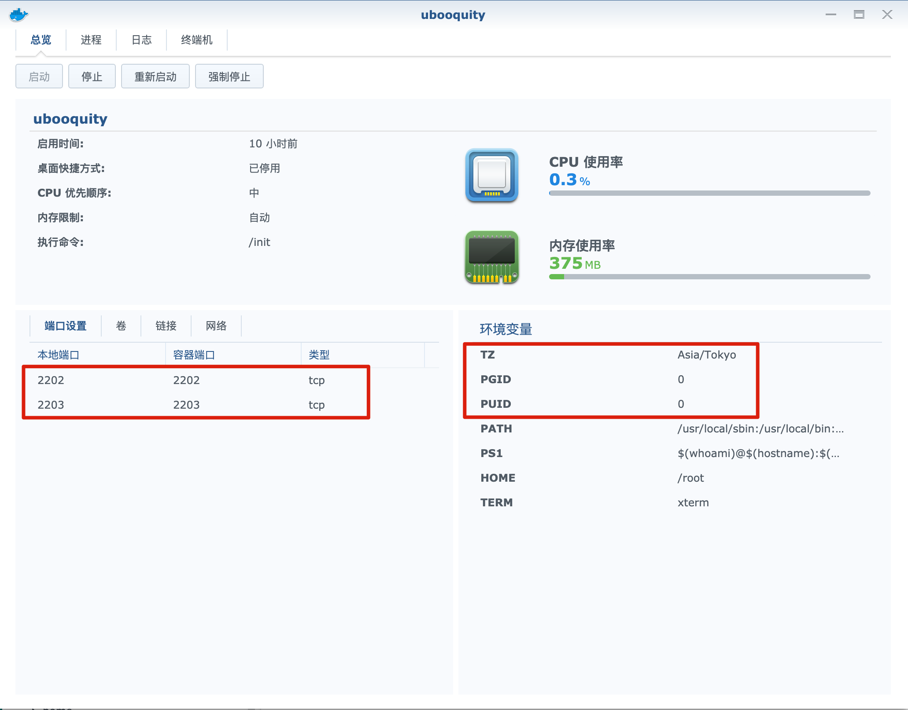
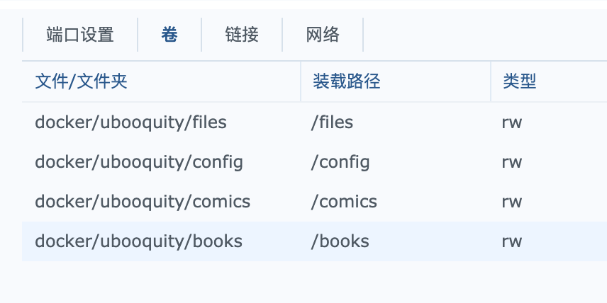
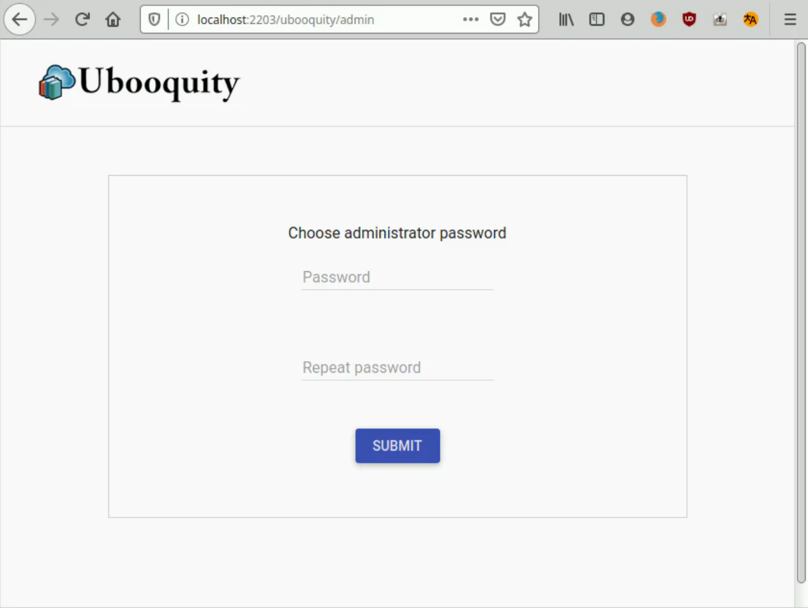
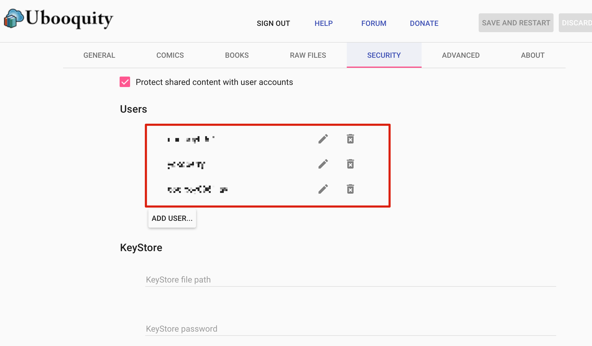
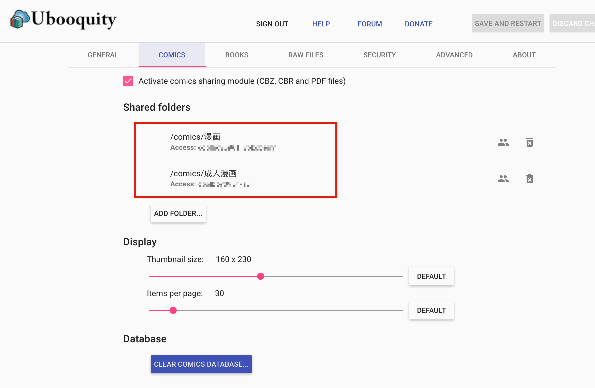
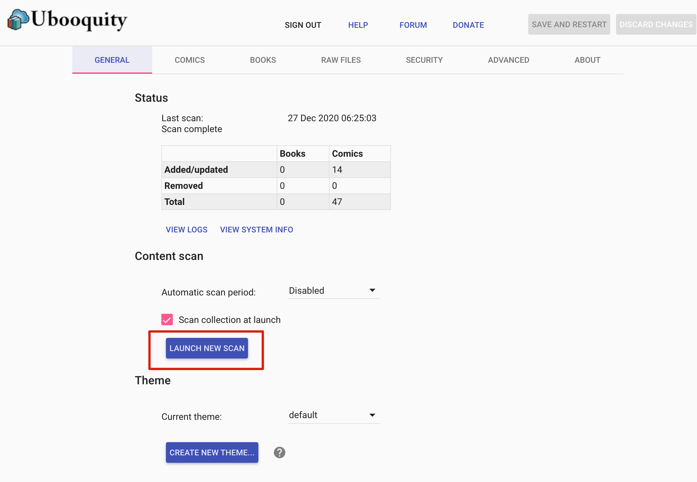
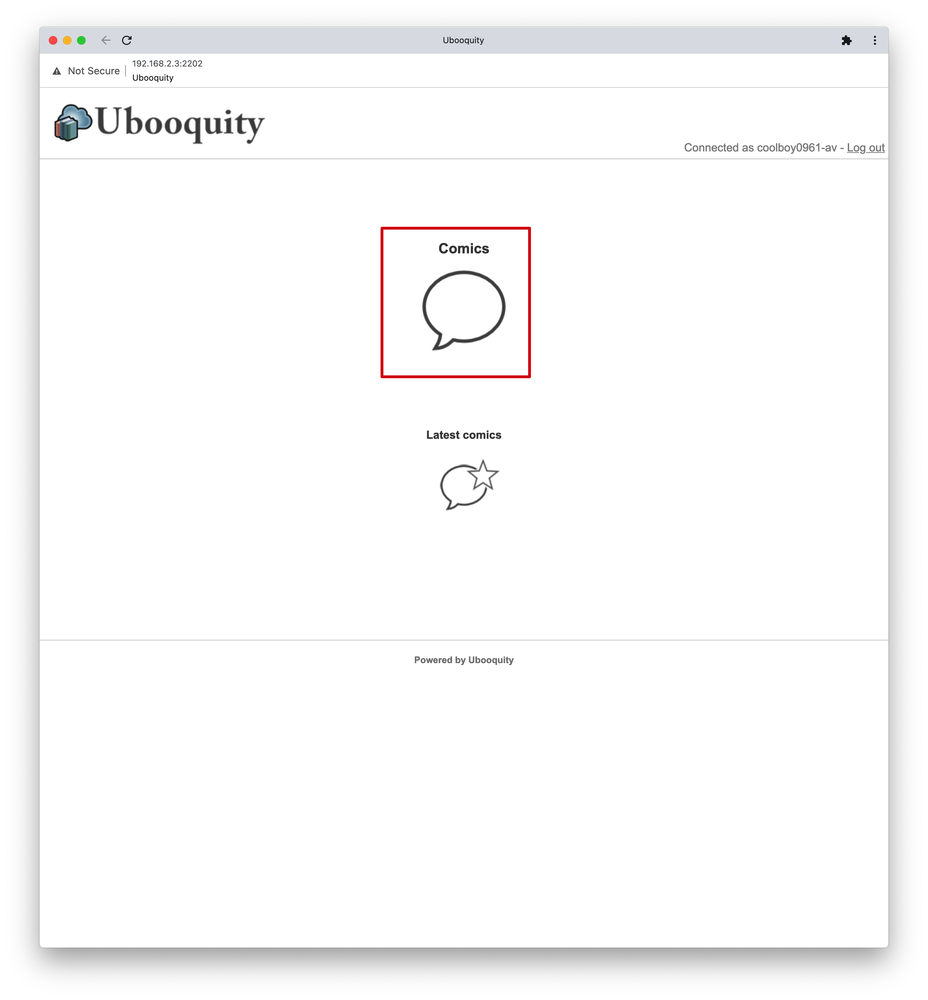
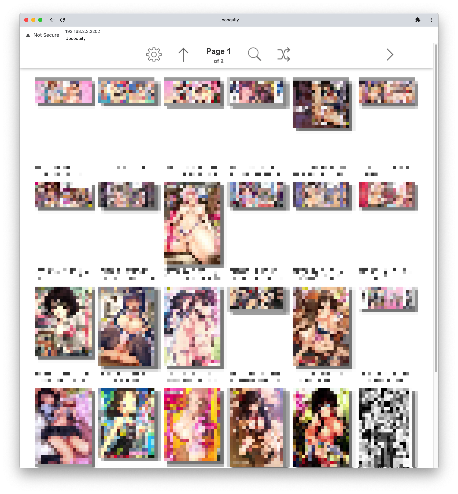

# 电子书管理

## 小说
使用Calibre Web进行管理。  
设置方法参考[https://blog.csdn.net/was172/article/details/107827668](https://blog.csdn.net/was172/article/details/107827668)。

### 教程与实际不同的地方
1. 卷文件夹创建到`/docker/calibre`，这样就不需要考虑文件夹权限了。也就不会出现教程中的上传书籍时的权限错误了。
1. 关于成人内容的隐藏，教程中并没有说，这里可以通过给成人内容打上特有的标签，然后在用户设定中隐藏。
修改书籍标签的位置  
  
用户设定隐藏标签的位置  
  
这样就可以实现只有特定用户可以看成人内容了。

## 漫画
本来是想都用Calibre Web进行管理的，但是不知道为什么Calibre Web的网页浏览无法打开cbz的漫画，一直显示loading。  
所以这里选择用ubooquity进行管理。

### 下载docker镜像
下载linuxserver/ubooquity的最新版。

### 建立容器
端口和环境变量设定  

卷设定  

Check容器自动重启

启动容器

### ubooquity的使用方法
#### 管理页面
URL:http://你的NAS的IP:2203/ubooquity/admin  
设置你的管理密码。

添加用户  

添加漫画文件保存文件，并设定可访问的用户。  

将你的漫画(.cbz, .cbr)拷贝到上面的目录后执行扫描。  

#### 漫画浏览页面
URL:http://你的NAS的IP:2202/ubooquity

输入用户名密码后将显示这个用户所允许观看的漫画。  
  
  
