# 構築方法

## ハードウェア
### 完成形
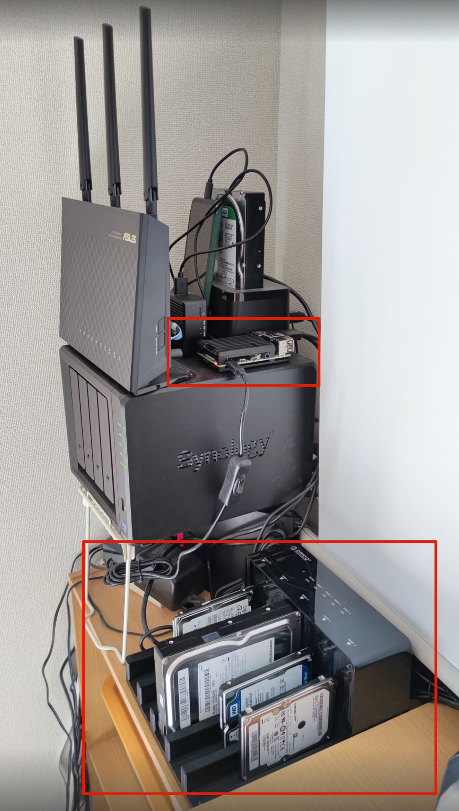
### Raspberry Pi 4
下記セットを購入しました。  
https://www.amazon.co.jp/gp/product/B082VVBKRP/ref=ppx_yo_dt_b_asin_title_o01_s00?ie=UTF8&psc=1

購入後ファンがうるさくて、下記金属ケースに買い替えました。  
https://www.amazon.co.jp/gp/product/B07X38B685/ref=ppx_yo_dt_b_asin_title_o00_s00?ie=UTF8&psc=1

### HDD ケース
Raspberry Pi 4でソフトRaidを組むつもりですので、下記RAID機能のないものにしました。  
https://www.amazon.co.jp/gp/product/B07VB6H4ZG/ref=ppx_yo_dt_b_asin_title_o01_s01?ie=UTF8&psc=1

## ソフトウェア
### サーバーOS
#### イメージ作成
下記でまずSDカードを作るRaspberry Pi Imagerをダウンロードします。  
https://www.raspberrypi.org/software/

今回は完全にサーバー用なので、Raspberry Pi OS Lite(32-bit)を選択してSDカードに書き込む。
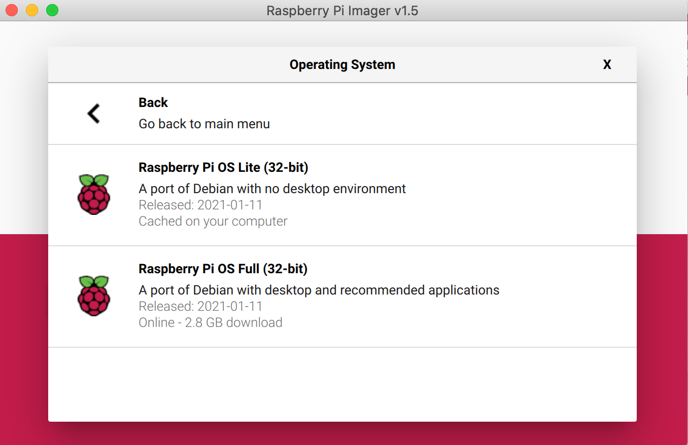

SDカードの書き込みが完了後、SSHを有効化するために、
SDカードのルートディレクトリに「ssh」という空ファイルを置く。

#### Raspberry Piに入る
SDカードをRaspberry Piに挿入して起動する。
イーサネットケーブルも挿入して、ルーターでIPを確認する。

それで`ssh pi@your-raspberrypi-ip`でアクセスできるようになります。  
デフォルトユーザとパスワードは下記です。
```
ユーザ名　：pi
パスワード：raspberry
```

#### raspberry piの初期設定
```
// パスワードの変更
$ passwd

// ホスト名変更 (任意)
$ sudo vi /etc/hostname
$ sudo vi /etc/hosts

// 再起動（ホスト名変更の反映）
$ sudo shutdown -r now

// Raspberry Piの設定（CUIモード）
$ sudo raspi-config

// ファイルシステムの拡張
7 Advanced Options → A1 Expand Filesystem

// ロケール等の変更
4 Localisation Options → I1 Change Locale → ja_JP.UTF-8 UTF-8 → スペース選択* → OK
ja_JP.UTF-8 → OK

// タイムゾーンの変更
4 Localisation Options → I2 Change Timezone → Asia → Tokyo

// Wi-Fi利用国の変更
4 Localisation Options → I4 Change Wi-fi Country → JP Japan

// 終了＆再起動
Finish → Yes
```
### NAS OS
#### openmediavaultのインストール
今回はopenmediavaultというOSSのNAS OSを使います。
```
// piユーザへのsshユーザグループの追加
$ sudo adduser pi ssh

// リポジトリ一覧を更新
$ sudo apt update

// アップグレードの実行
$ sudo apt upgrade
途中、Yキー押下
途中、qキー押下

// ディレクトリ移動
$ cd /opt/

// openmediavaultのインストール
$ wget -O - https://github.com/OpenMediaVault-Plugin-Developers/installScript/raw/master/install | sudo bash

// 再起動
$ sudo reboot
```

#### openmediavaultへアクセス
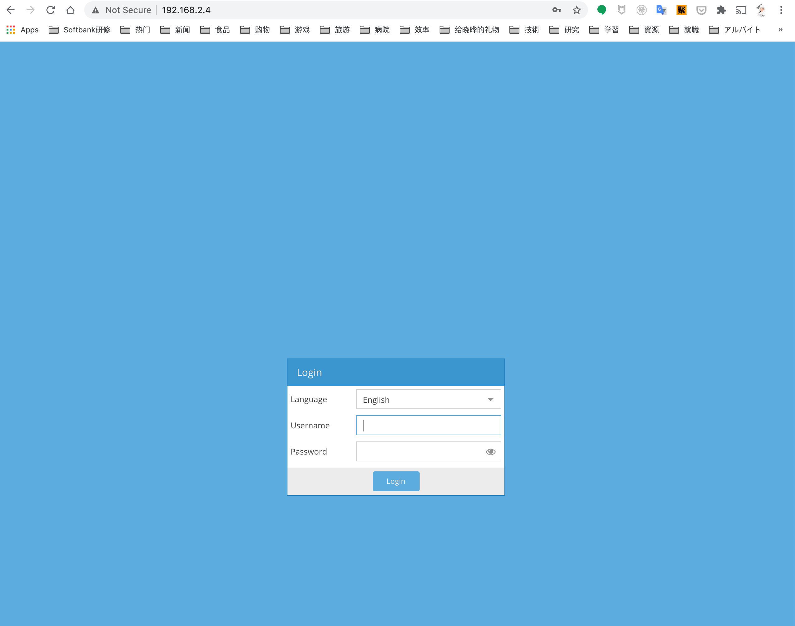

初期ユーザとパスワードは下記です。
```
ユーザ名：admin
パスワード：openmediavault
```

最初からネットワークが設定されています。
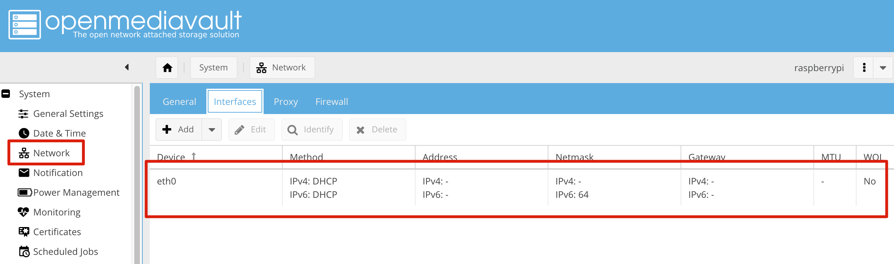

### RAID
最初はRAID5を組もうかと思いましたが、以下理由で諦めました。
1. openmediavaultはUSB接続のHDDをRAIDのデバイスとして認識しない。mdadmコマンドで頑張ることもできますが、USB Raidは非常に不安定だという情報が結構でているため、使わないようにしました。
1. RAID5だとすべてのファイルシステムのサイズを揃わなければなりません。自分の古いディスクはサイズがバラバラでファイルシステムのサイズをあわせるのが面倒だし、大きいHDDが死んだらデータロストになるのでやめました。

そこで選択したのは「SnapRaid」というRaid方式でした。公式的に下記でマニュアルが公開されていますが、流石にコマンドベースだときついです。  
https://www.snapraid.it/manual

幸い、openmediavaultのpluginとしてインストール、そして設定することができます。

#### SnapRaidのメリデメ
SnapRaidは一般的なRAIDと全く違う仕組みです。
一般的なRAIDはデータの読み書き時に常に分散するのですが、SnapRaidはデータの読み書きに一切関与せず、データのバックアップと復旧だけ考えます。

RAIDはリアルタイムにデータの冗長化を行っていますが、SnapRaidは決まったタイミングでしか冗長化データを同期しません。

|方式|メリット|デメリット|
|-|-|-|
|RAID|・リアルタイムにデータの冗長化を行う<br />・HDDが壊れたときに自動的にデータのリバランスを行う|・ハードディスクのサイズに厳しい制約がある<br />・HDDの接続方式に厳しい制約がある|
|SnapRaid|・ハードディスクのサイズが自由<br />HDDの接続方式が自由|・決まったタイミングでしかデータ冗長化をおこわないため、HDDが壊れたときに二回の同期の間に更新したデータがロストされる<br />・HDDが壊れたときに手動で復旧コマンドの実行が必要|

したがって、SnapRaidは頻繁な更新が発生する利用シーンに向いていないです。ただ一般的家庭用では十分だと思います。

#### SnapRaidのインストール

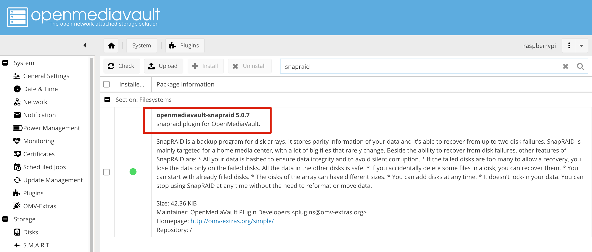

#### SnapRaidの設定

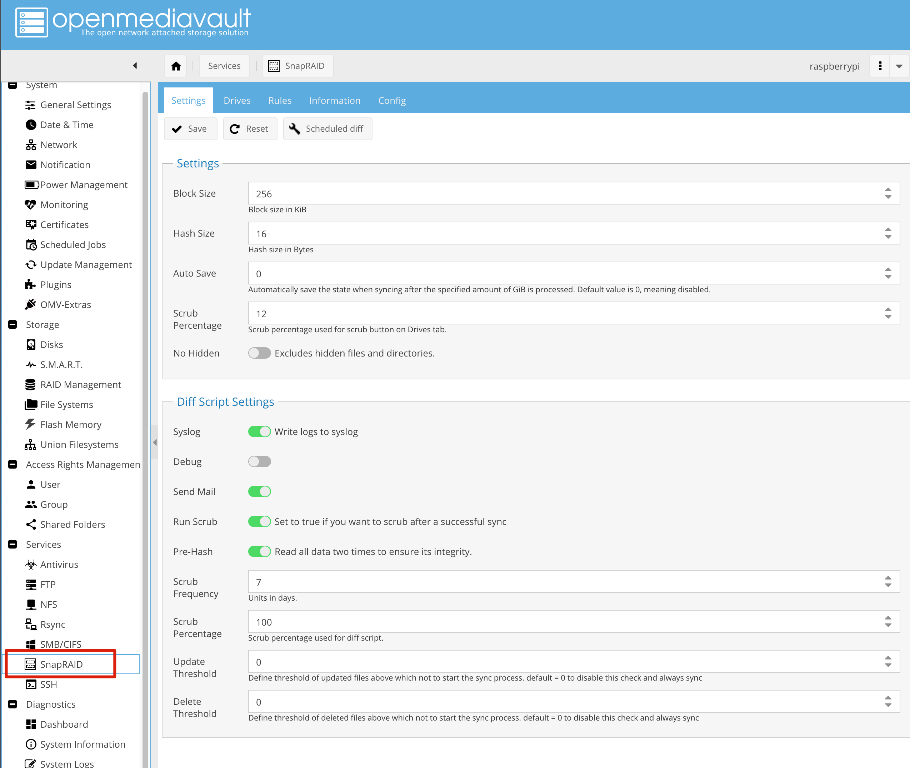

ここはデフォルトそのままにしています。

いくつか概念を説明します。

- Diff  
  前回の同期結果と比べて変更点をチェック
- Sync  
  最新の実データに合わせて冗長化データの最新化を行う
- Pre-Hash  
  Syncを行う前に先にデータを確かめる。使わないとわずかの確率ですが、一部のデータが冗長データに同期されない可能性があります。
- Scrub  
  データ冗長化に不備がないかチェック
- Scrub Frequency  
  Scrubを実行する頻度です。Scrubは非常に時間がかかる処理なので、ここで7日に1回実行するように設定されています。
- Scrub Percentage  
  何％のデータに対してScrbuを行うか設定します。100%だと200GBのデータの場合およそ2時間かかります。
- Update  
  前回の同期と比べて更新されたファイル数
- Delete  
  前回の同期と比べて削除されたファイル数

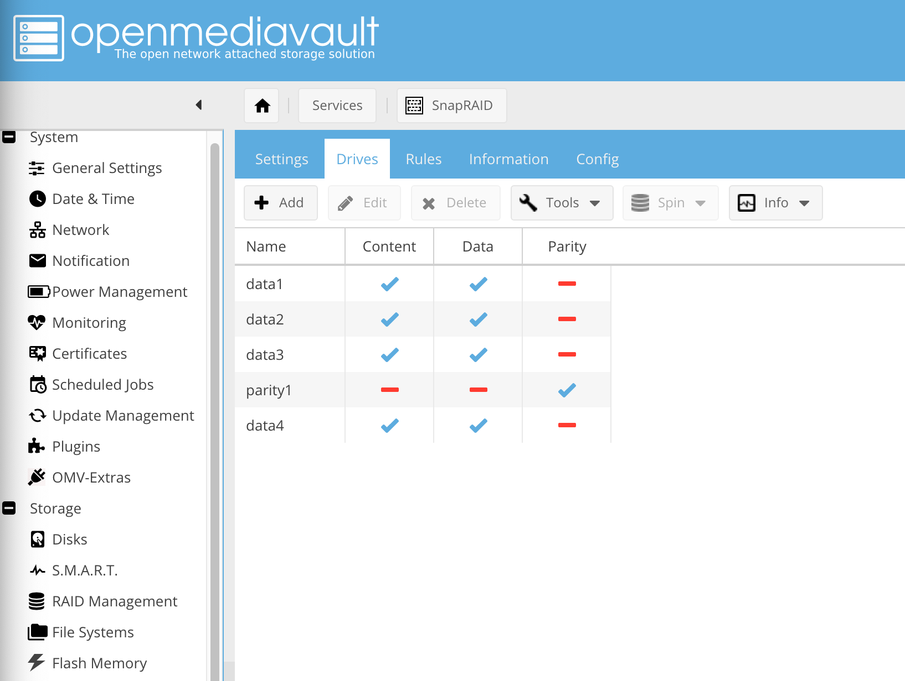

ここでSnapRaidに組むディスクを選択します。

いくつか概念を説明します。

- Data  
  実データを保存する
- Content  
  実データの冗長化データがどこに保存されているか保持
- Parity  
  冗長化データを保存

複数のHDDの中、一番大きいHDDをParityにすれば、RAID5と同じように一台のHDDが壊れてもデータを復旧することができます。同じ道理で一番大きいHDD二台をParityにすれば、RAID6と同じように二台のHDDが壊れてもデータを復旧することができます。

したがって、上の図に示すように、全部で5台のHDDのうち、一台を冗長化データ保存用にしています。

#### 定期的に同期を実施

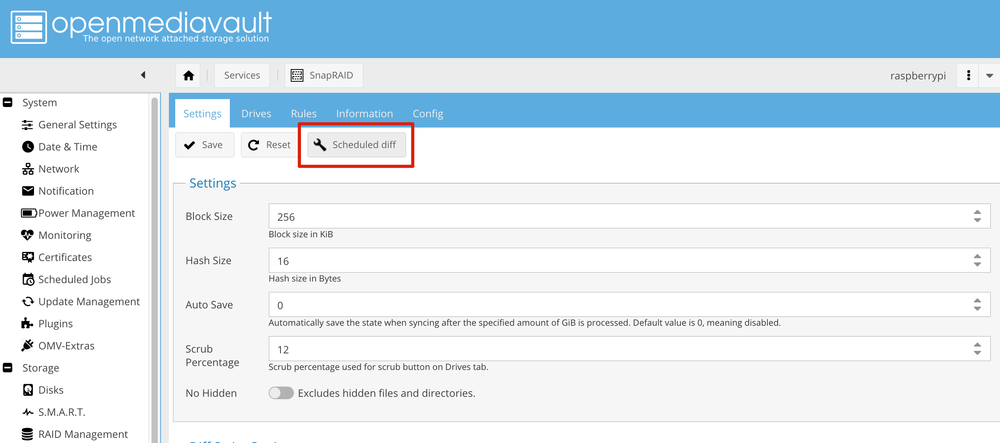

Scheduled diff ボタンを押して

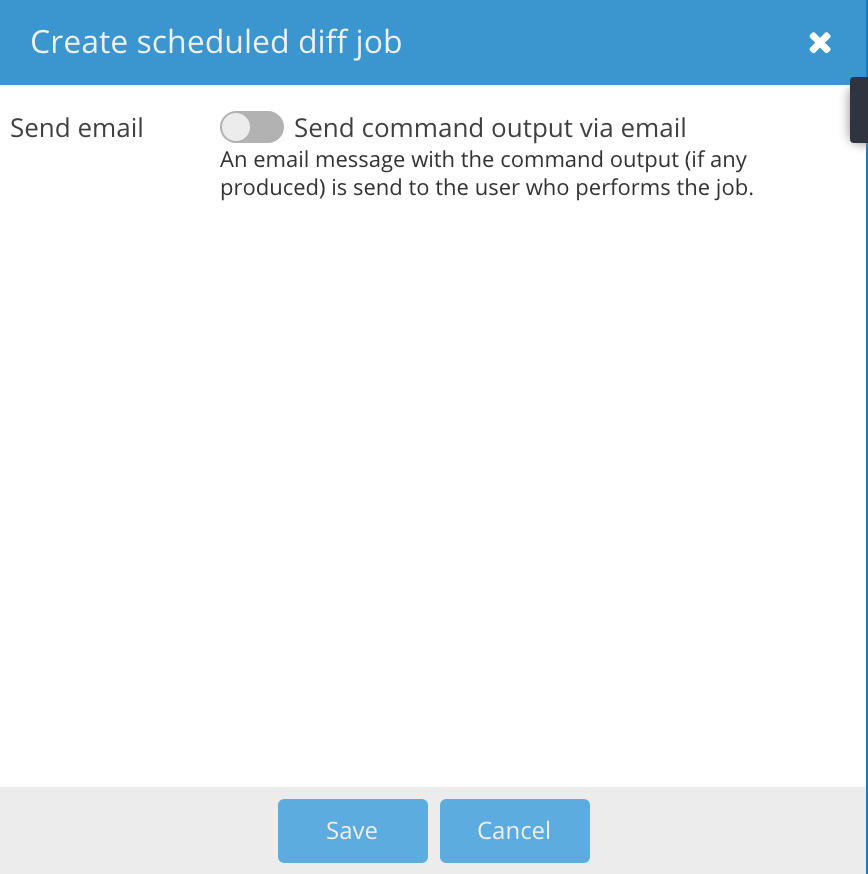

Save ボタンを押せば、

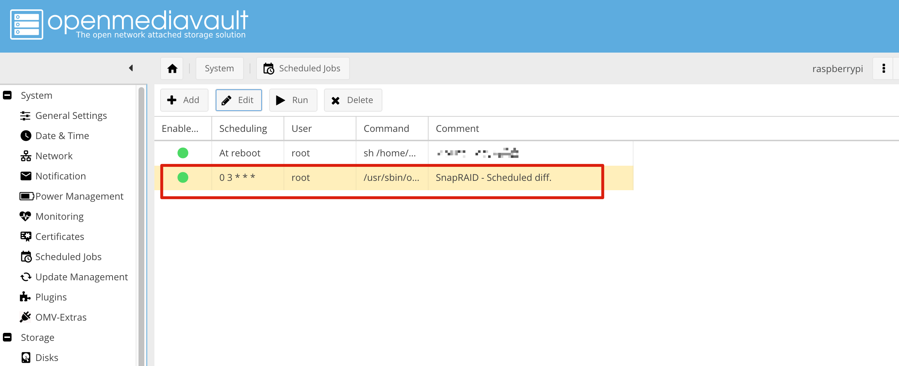

Dailyジョブが作成されます。Editで自分の好みの時間で実行するように設定できます。

### Union Filesystems

普通のRAIDであれば冗長化を行う同時にファイルシステムの論理化も行ってくれます。それで、複数のHDDが一つのファイルシステムになります。ただ、SnapRaidはそれをやりません。したがって、別途論理化を行う必要があります。そこで今回選択したのはUnion Filesystemsです。

#### Union Filesystemsのインストール

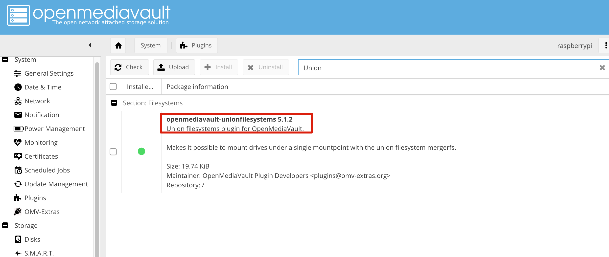

こちらも同じくopenmediavaultのpluginとしてインストールすることができます。

#### Union Filesystemsの設定

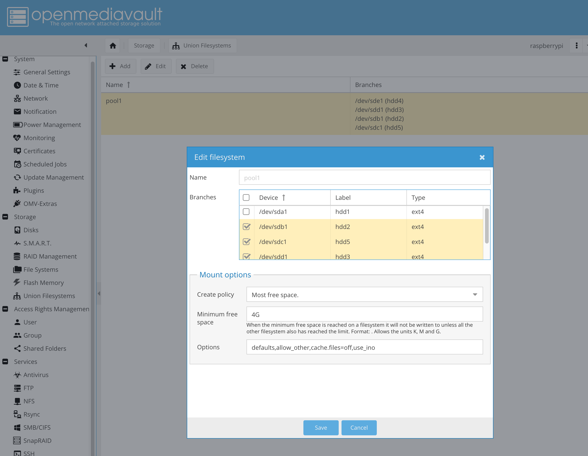

ここで実データを保存するファイルシステムだけ選択します。Greate policyをMost free spaceにします。これでデータを書き込む際に常にもっとも空き領域の多いHDDに書き込むようになります。

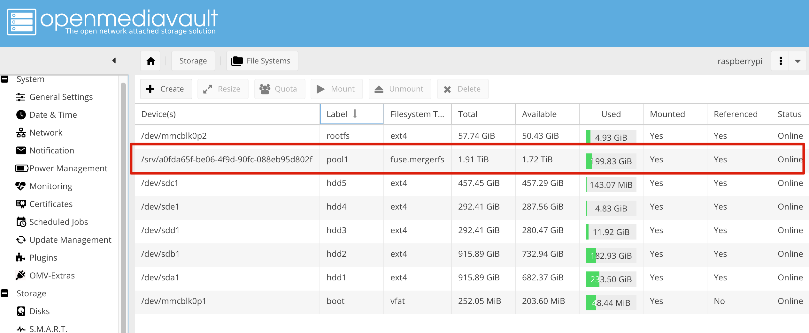

それで複数のHDDから融合されたファイルシステムが作成されます。

### その他

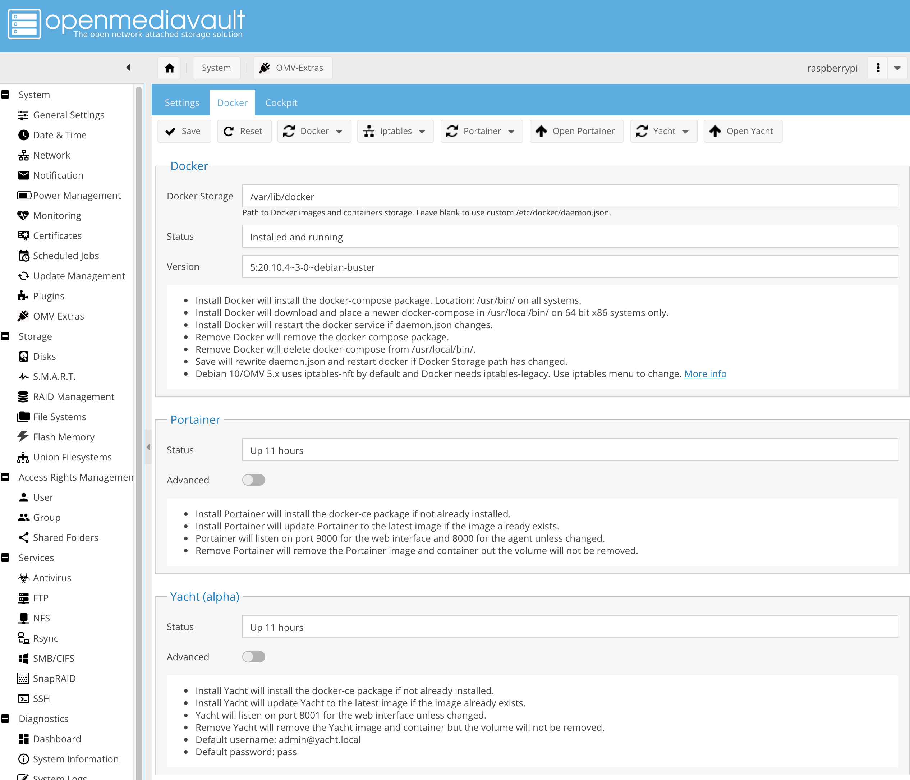

ほかに拡張機能を追加したければ、Dockerをインストールすることを勧めます。