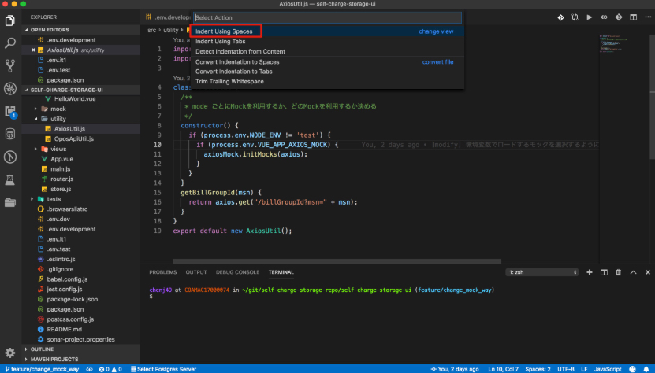

# Vue

## CheckStyle
vuejsの公式コーディング規約  
https://jp.vuejs.org/v2/style-guide/index.html

チェックツールはvscodeの下記プラグインを利用する。  
- ESLint
- Vetur

## Formatter
自動フォーマットはvscodeの下記プラグインを利用する  
- Vetur
- Beautify

## vscodeの設定

indentが2にならない場合、以下のように設定。

