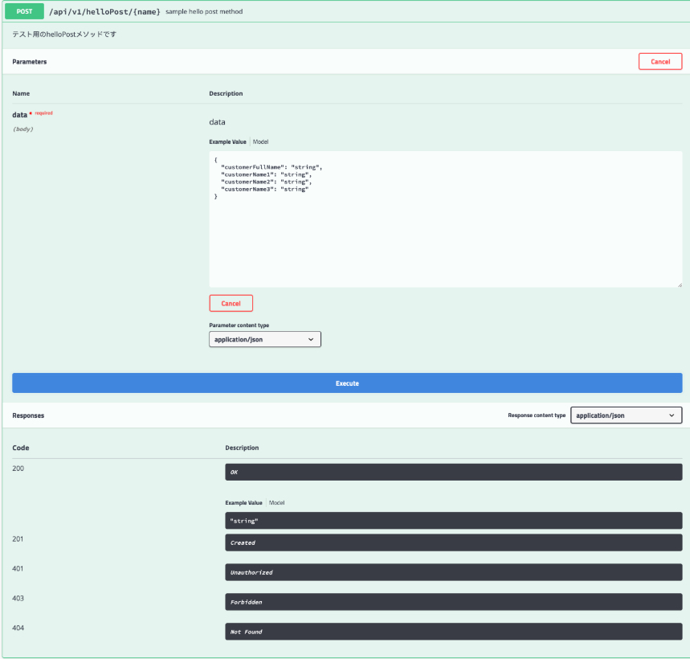
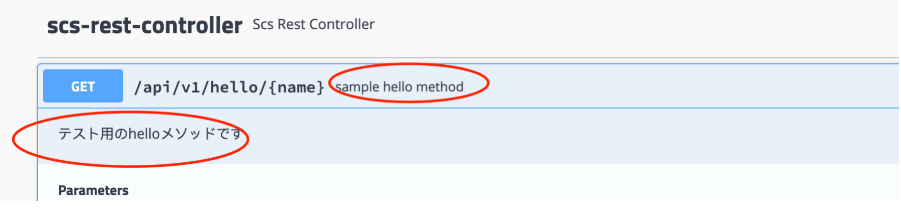
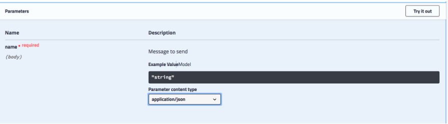

# Swagger2の使い方

## 前提
* ドキュメントにおこしたいRestControllerクラスに、以下アノテーションがクラスについていること

        @RestController
        @RequestMapping("api/v1/")

## 使い方
* ドキュメント生成の対象とするAPIのURLを指定
    * src/main/java/jp/co/sample/Swagger2Config.javaのpath()にcontainsPatternを追加
    * 以下例でいうと、/api/v1と/api/v2のRequestMappingがドキュメント生成対象となる

                    .
                    .
                    Predicates.containsPattern("/api/v1/"),
                    Predicates.containsPattern("/api/v2/")
                    .
                    .

* 後は上記RequestMapping内に作成したAPIメソッドの仕様が以下に自動生成される

        http://localhost:8080/sample/swagger-ui.html

* 注意
    * RequestMethodを明示的に指定してください。でないと、Swaggerには全てのRequestMethod分が出力されてしまいます。
        * 以下例でいうと、`@RequestMapping(value = "/helloPost/{name}", method = RequestMethod.POST, produces = "application/json")`の部分

## Example
* APIメソッド

        @ApiOperation(value = "sample hello post method", notes = "テスト用のhelloPostメソッドです")
        @RequestMapping(value = "/helloPost/{name}", method = RequestMethod.POST, produces = "application/json")
        String helloPost(@RequestBody BCustomerInfo data) {
            return "hogehoge";
        }

* 生成結果

## Tips

### Response content type を表示する
* RequestMappingにproduceパラメータをつける

        @RequestMapping(value = "/helloPost/{name}", method = RequestMethod.POST, produces = "application/json")

### デフォルトのレスポンスコード(401,403,404など)を非表示にしたい
* src/main/java/jp/co/sample/Swagger2Config.javaの swaggerSpringMvcPlugin に以下を追記

        .useDefaultResponseMessages(false)

### APIにコメントを残したい
* メソッドに以下アノテーションをつける

        @ApiOperation(value = "sample hello method", notes = "テスト用のhelloメソッドです")

* 生成結果

### ParametersのNameとDescriptionに追加したい
* メソッドのAgrumentに以下アノテーションをつける

        @ApiParam(name="name",value = "Message to send", required=true)

* 生成結果

