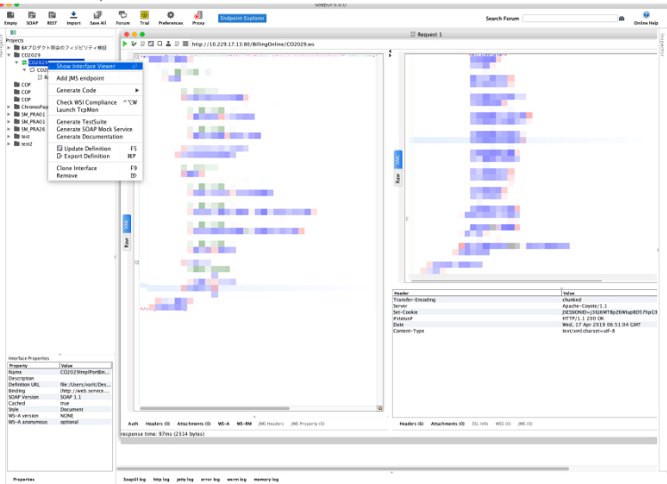
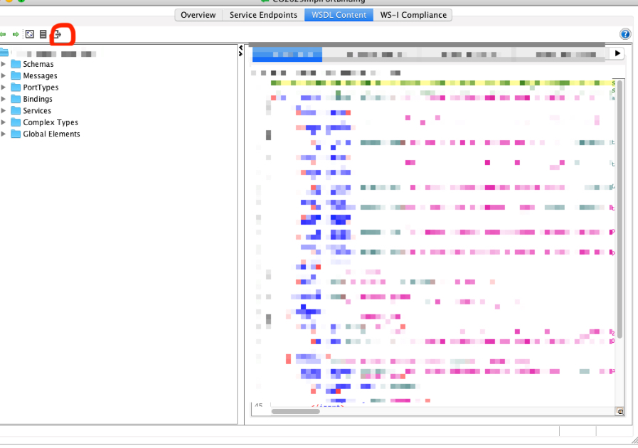
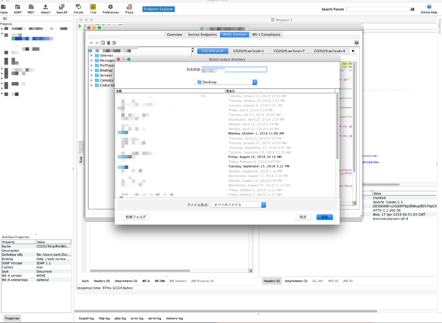

# WSDLのダウンロード方法

## 概要

WSDLは`http://localhost:8080/sample.ws?wsdl`のようなリンクで公開されていますが、そのまま使うと、soap通信するたびに、WSDLへのHTTP通信が発生します。欠点は下記2点ある。

1. 余計なHTTP通信が発生するため、性能に影響する
2. 自動テストの際に、WSDLを公開しているサーバーが落ちていると、テストできなくなる。

したがって、解決策としてWSDLをダウンロードしてローカルに保存する必要がある。ただし、複数階層のあるWSDLだと、ブラウザとか、wgetとかのやり方は一部の情報しかダウンロードできない。

SOAPUIに複数階層のWSDLを全部一気にダウンロードする機能がある。

## 方法

  
  

