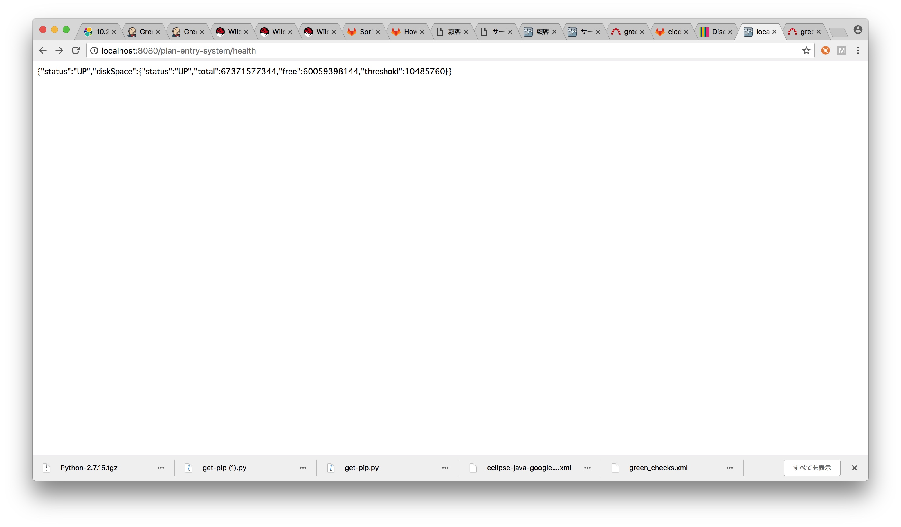
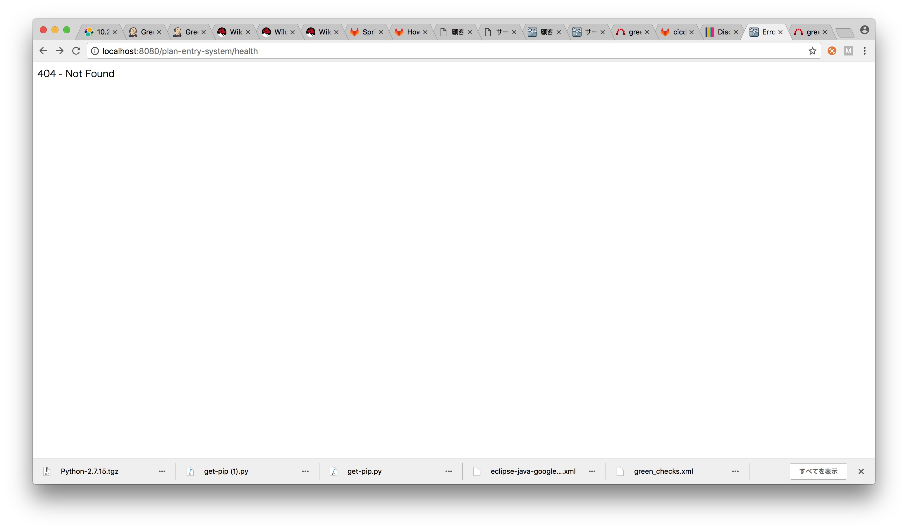
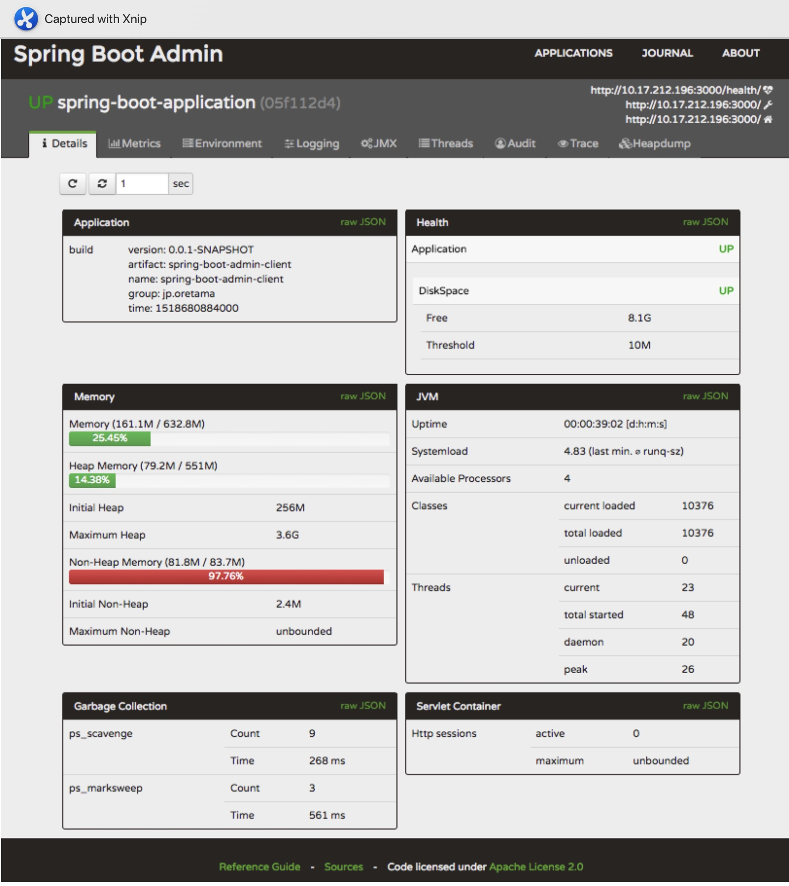

# Spring Boot Actuator
## POM追加
```
<dependency>
	<groupId>org.springframework.boot</groupId>
	<artifactId>spring-boot-starter-actuator</artifactId>
	<scope>compile</scope>
</dependency>
```
## application.properties追加
```
management.security.enabled=false
management.add-application-context-header=false
```
`management.security.enabled=false`でブラウザでアクセスできるようになります。  
`management.add-application-context-header=false`でRequestにあるport情報がなくなる。

```
$ curl 'http://localhost:8080/plan-entry-system/metrics' -i -H 'Accept: application/vnd.spring-boot.actuator.v1+json'
HTTP/1.1 200 OK
Connection: keep-alive
Transfer-Encoding: chunked
Content-Type: application/vnd.spring-boot.actuator.v1+json;charset=UTF-8
X-Application-Context: application:8080
Date: Thu, 17 May 2018 05:16:18 GMT

{"mem":680919,"mem.free":288970,"processors":4,"instance.uptime":23035,"uptime":30341,"systemload.average":2.74267578125,"heap.committed":611328,"heap.init":262144,"heap.used":322357,"heap":3728384,"nonheap.committed":71296,"nonheap.init":2496,"nonheap.used":69592,"nonheap":0,"threads.peak":12,"threads.daemon":5,"threads.totalStarted":15,"threads":12,"classes":8694,"classes.loaded":8694,"classes.unloaded":0,"gc.ps_scavenge.count":6,"gc.ps_scavenge.time":114,"gc.ps_marksweep.count":2,"gc.ps_marksweep.time":209}%
```

```
$ curl 'http://localhost:8080/plan-entry-system/metrics' -i -H 'Accept: application/vnd.spring-boot.actuator.v1+json'
HTTP/1.1 200 OK
Connection: keep-alive
Transfer-Encoding: chunked
Content-Type: application/vnd.spring-boot.actuator.v1+json;charset=UTF-8
Date: Thu, 17 May 2018 05:19:58 GMT

{"mem":682560,"mem.free":292711,"processors":4,"instance.uptime":7056,"uptime":14135,"systemload.average":2.18115234375,"heap.committed":613888,"heap.init":262144,"heap.used":321176,"heap":3728384,"nonheap.committed":71232,"nonheap.init":2496,"nonheap.used":68673,"nonheap":0,"threads.peak":12,"threads.daemon":5,"threads.totalStarted":15,"threads":12,"classes":8690,"classes.loaded":8690,"classes.unloaded":0,"gc.ps_scavenge.count":6,"gc.ps_scavenge.time":102,"gc.ps_marksweep.count":2,"gc.ps_marksweep.time":202}%
```

## Health checkのやり方
### wildflyでplan-entry-system.warをenableしている場合


### wildflyでplan-entry-system.warをdisableしている場合


# help doc も見れる
## POM追加
```
<dependency>
	<groupId>org.springframework.boot</groupId>
	<artifactId>spring-boot-actuator-docs</artifactId>
	<scope>compile</scope>
</dependency>
```
ブラウザで`http://localhost:8080/plan-entry-system/docs/`にアクセス。

## Spring Boot Adminについて
[https://github.com/codecentric/spring-boot-admin](https://github.com/codecentric/spring-boot-admin)



ただし社内リポジトリに存在しない。

## メトリクスの意味
<table>
<thead>
<tr>
<th>name</th>
<th>意味</th>
</tr>
</thead>
<tbody>
<tr>
<td>httpsessions.max</td>
<td>セッション数の上限（-1は上限無し）</td>
</tr>
<tr>
<td>httpsessions.active</td>
<td>現在のセッション数</td>
</tr>
<tr>
<td>datasource.(DB).active</td>
<td>DBのアクティブセッション数</td>
</tr>
<tr>
<td>datasource.(DB).usage</td>
<td>DBの使用率（0.0～1.0）</td>
</tr>
<tr>
<td>mem</td>
<td>確保済みのメモリサイズ[KB]</td>
</tr>
<tr>
<td>mem.free</td>
<td>mem内の空きサイズ[KB]</td>
</tr>
<tr>
<td>processors</td>
<td>CPUコア数</td>
</tr>
<tr>
<td>instance.uptime</td>
<td>Spring Bootとしての起動時間[ms]</td>
</tr>
<tr>
<td>uptime</td>
<td>JVMの起動時間[ms]</td>
</tr>
<tr>
<td>systemload.average</td>
<td>OSのload average値（Windowsだと-1）</td>
</tr>
<tr>
<td>heap.committed</td>
<td>Javaヒープのコミット済サイズ[KB]</td>
</tr>
<tr>
<td>heap.init</td>
<td>Javaヒープの初期サイズ[KB]</td>
</tr>
<tr>
<td>heap.used</td>
<td>Javaヒープの使用中サイズ[KB]</td>
</tr>
<tr>
<td>heap</td>
<td>Javaヒープの最大サイズ[KB]</td>
</tr>
<tr>
<td>threads.peak</td>
<td>ピーク時のスレッド数</td>
</tr>
<tr>
<td>threads.daemon</td>
<td>デーモンスレッド数</td>
</tr>
<tr>
<td>threads</td>
<td>現在のスレッド数</td>
</tr>
<tr>
<td>classes</td>
<td>クラス数</td>
</tr>
<tr>
<td>classes.loaded</td>
<td>ロード済のクラス数</td>
</tr>
<tr>
<td>classes.unloaded</td>
<td>アンロードされたクラス数</td>
</tr>
<tr>
<td>gc.ps_scavenge.count</td>
<td>マイナーGCの回数</td>
</tr>
<tr>
<td>gc.ps_scavenge.time</td>
<td>マイナーGCの累積時間[ms]</td>
</tr>
<tr>
<td>gc.ps_marksweep.count</td>
<td>メジャーGC（Full GC）の回数</td>
</tr>
<tr>
<td>gc.ps_marksweep.time</td>
<td>メジャーGC（Full GC）の累積時間[ms]</td>
</tr>
<tr>
<td>counter.status.(code).(path)</td>
<td>pathとステータスコード毎のアクセス数</td>
</tr>
<tr>
<td>gauge.response.(path)</td>
<td>pathの最新のレスポンス時間[ms]</td>
</tr>
</tbody>
</table>