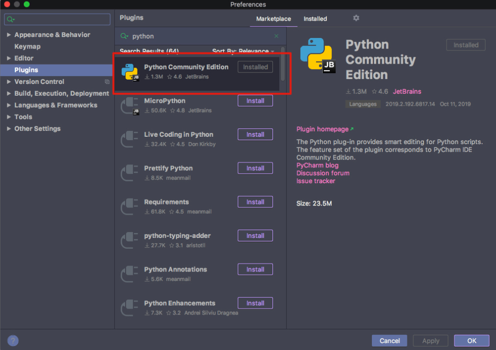
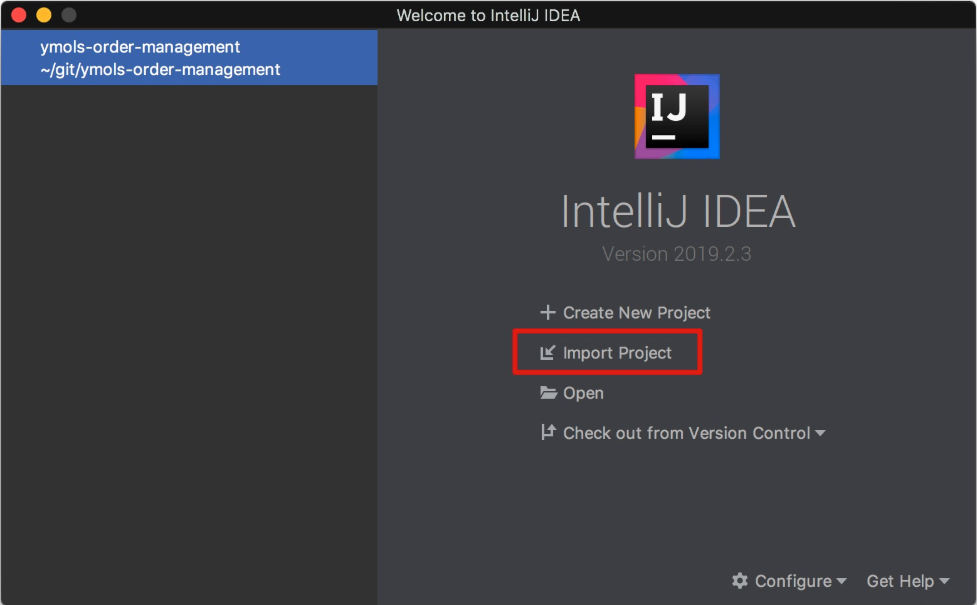
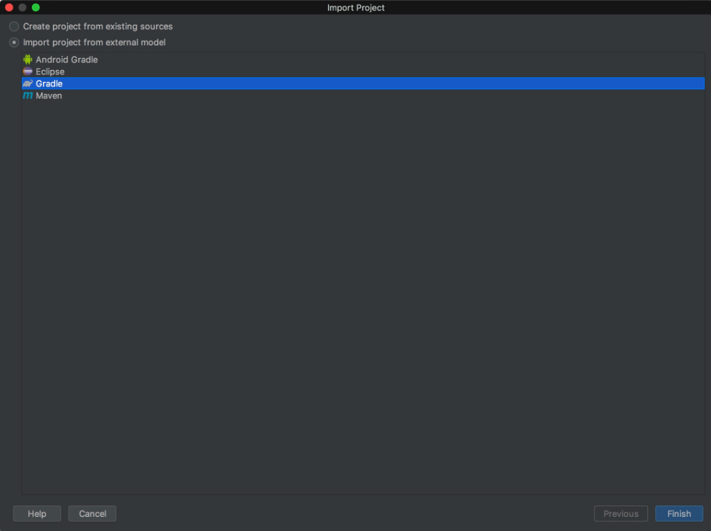
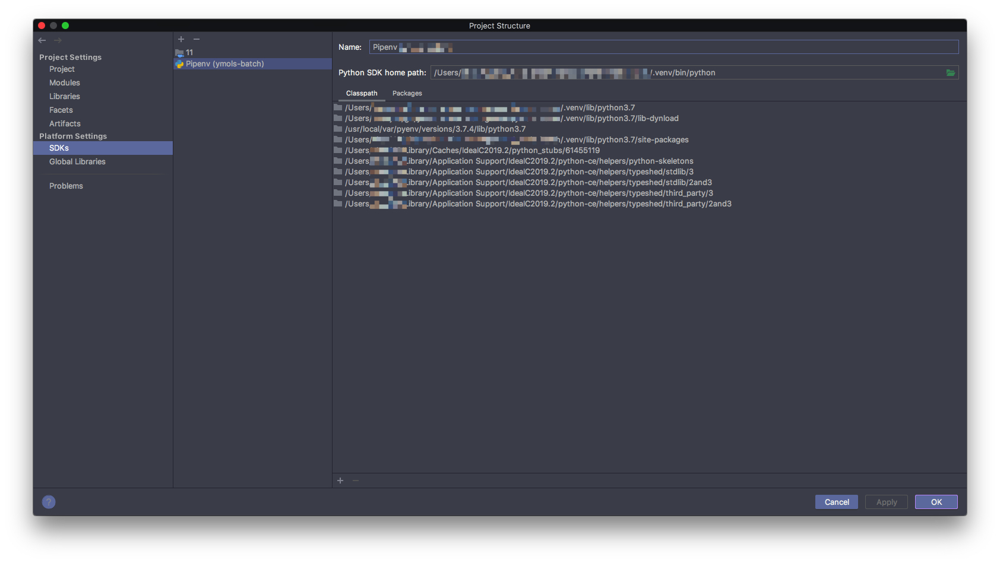
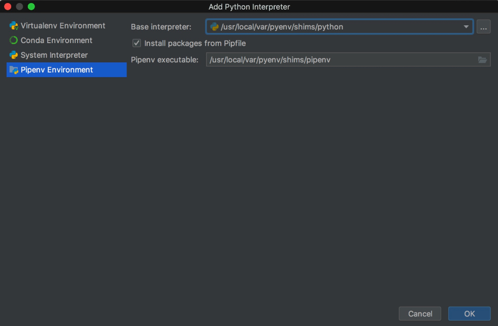
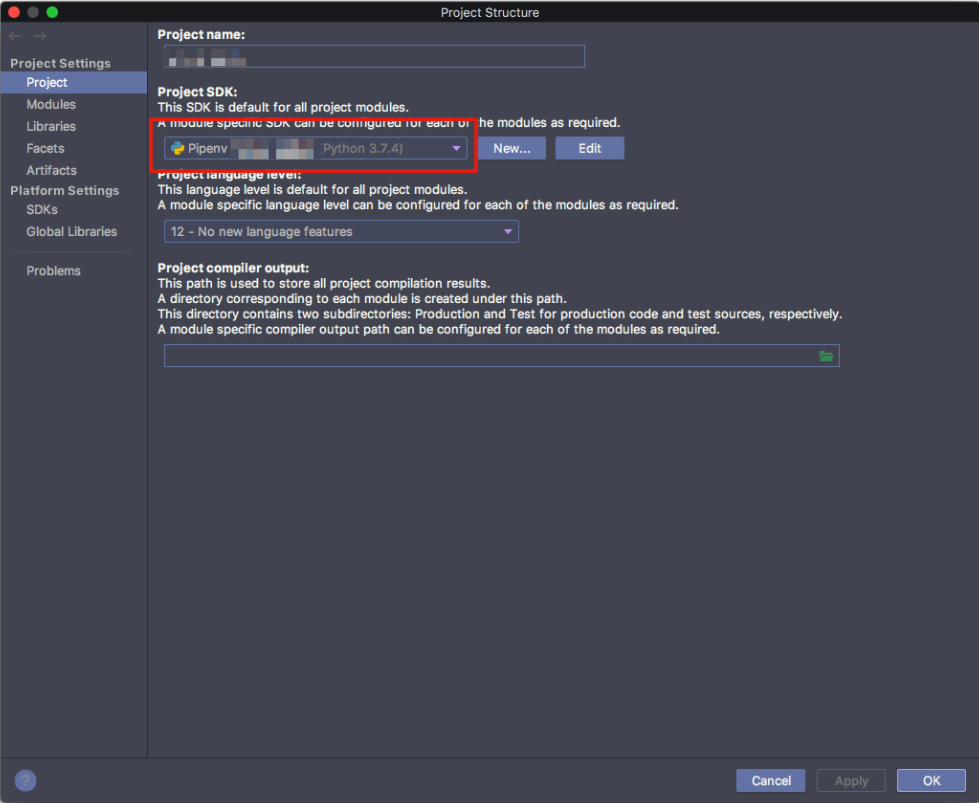
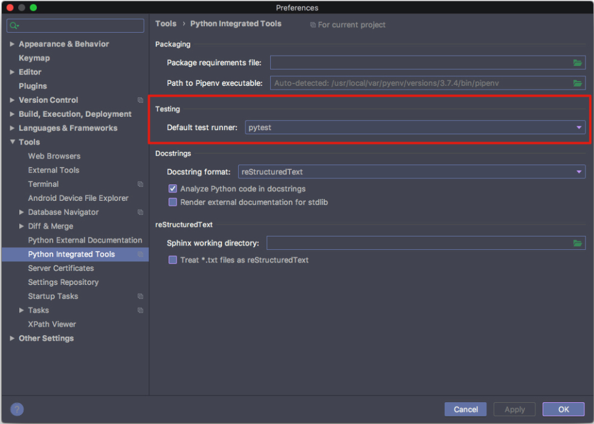
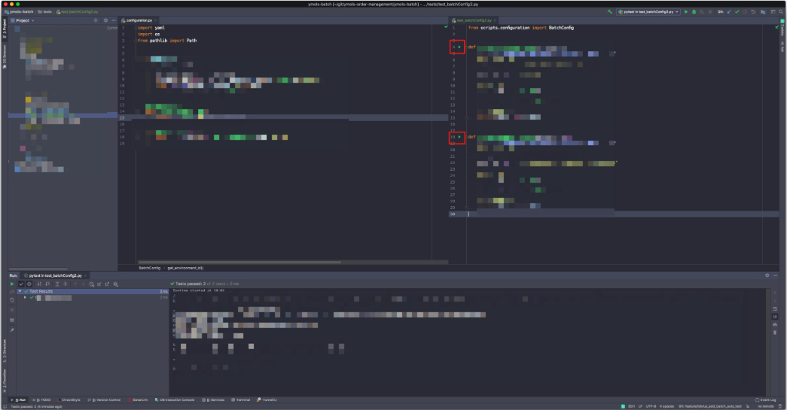

# Python開発環境構築方法

## Python関連ソフトウェアのインストール
### pyenv
pythonsを複数バージョン間で切り替えるためのツール。  
```bash
brew install pyenv
```

.bash_rc or .zsh_rcに下記設定を追加する。
```
# ~/.pyenvではなく、/usr/loca/var/pyenvを利用
export PYENV_ROOT=/usr/local/var/pyenv
# pyenvの自動補完機能を利用
if which pyenv > /dev/null; then eval "$(pyenv init -)"; fi
```
*下の手順を続ける前に、ターミナルを再起動してください。でないと、上の設定を適用できません。*
### Python
```bath
pyenv install 3.7.4
pyenv global 3.7.4

python --version
```
3.7.4のバージョンが確認できたらOKです。  
確認できなかった場合、ターミナルを再起動してから確認してください。

### pip
pipの設定ファイル追加
`~/.pip/pip.conf`
```
[global]
trusted-host = pypi.python.org
               pypi.org
               files.pythonhosted.org
```
pythonのパッケージをインストールするためのツール。
```bash
pip install --upgrade pip
```
pipを最新バージョンにアップデートします。

### pipenv
nodejsのnpmと同様にプロジェクトのパッケージ管理するためのツールです。
```bash
pip install pipenv
```

.bash_rc or .zsh_rcに下記設定を追加する。
```
# pipenvの仮想環境の保存場所をプロジェクトフォルダ内にする
export PIPENV_VENV_IN_PROJECT=1
```

### コマンド実行環境の構築
1. Batchプロジェクトが必要としているPython Packagesをインストール
  ```bash
  cd sample_dir
  pipenv install --dev
  ```
  *sample_dir配下に.venvフォルダが出来上がることを確認する。*

## Intellijの設定
### pythonのプラグインをインストール


### Batchプロジェクトをインポート  
  
  
  
  

### pythonのInterceptorを設定

1. Project Sturctureを開いて、SDKを確認する(Command + ;)  

1. デフォルトテストツールを`pytest`にする  

1. 既存のpythonのテストファイルを開く  
下記画像同様に「テスト実行」のボタンが出て、テスト実行できたらOKです。  
