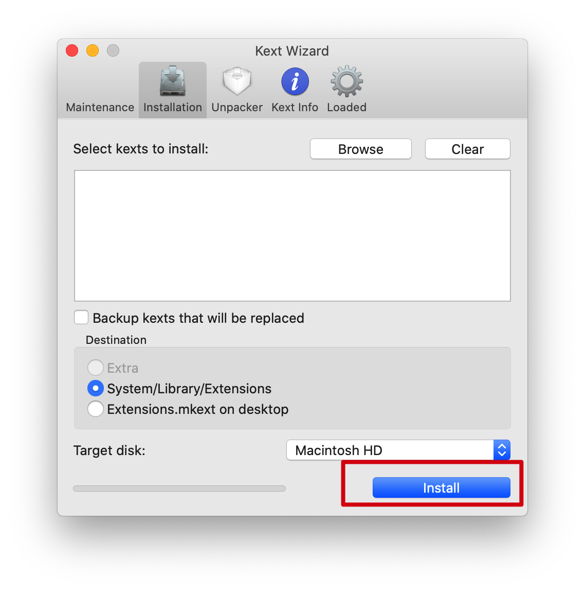
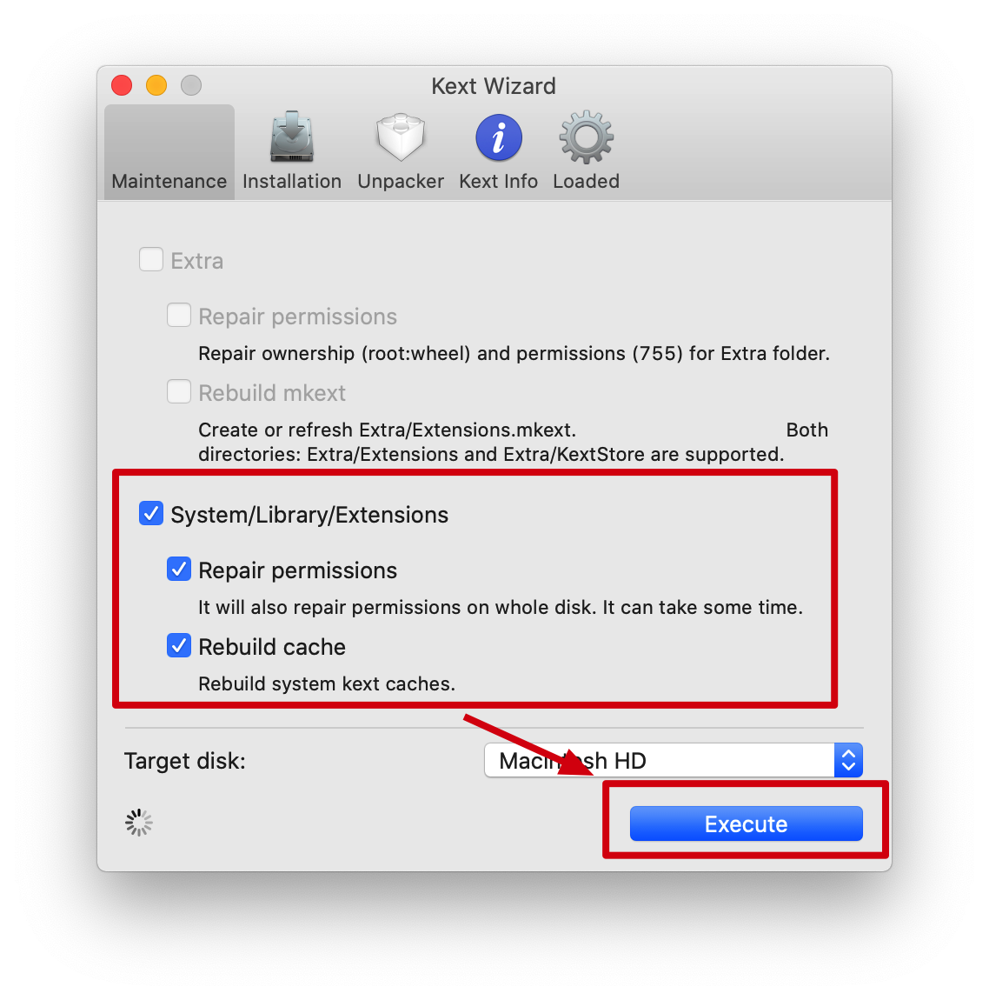
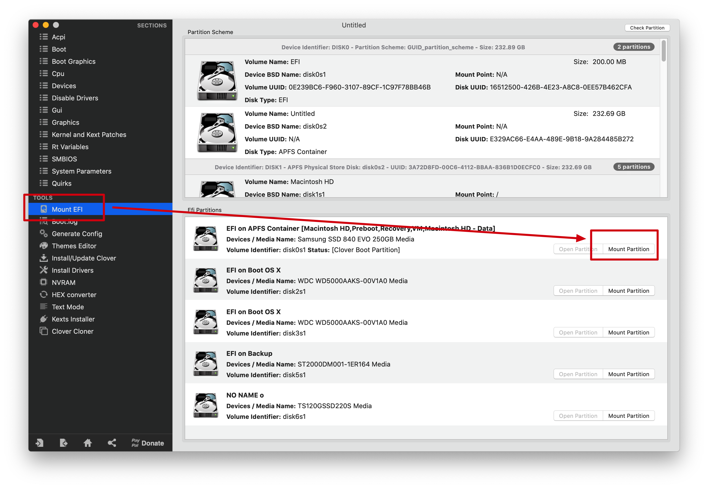
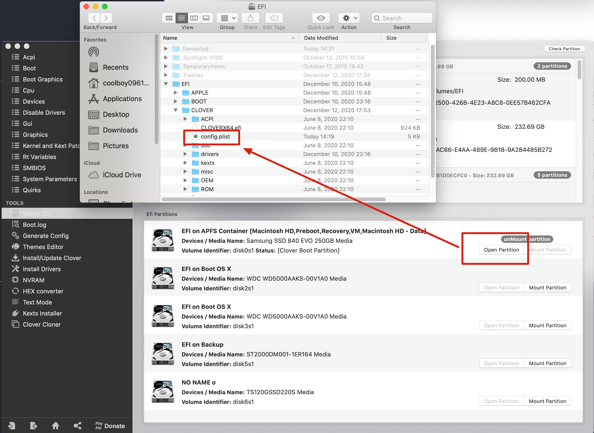
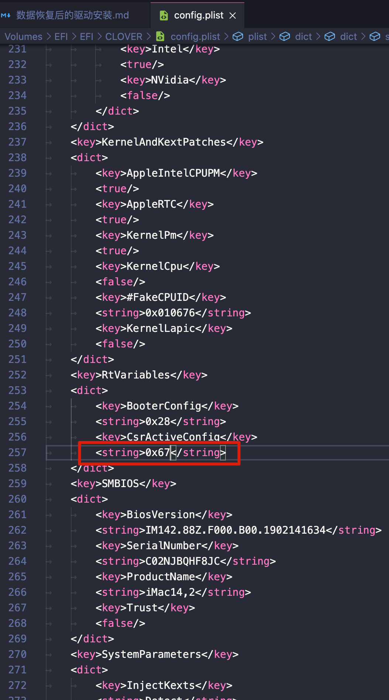
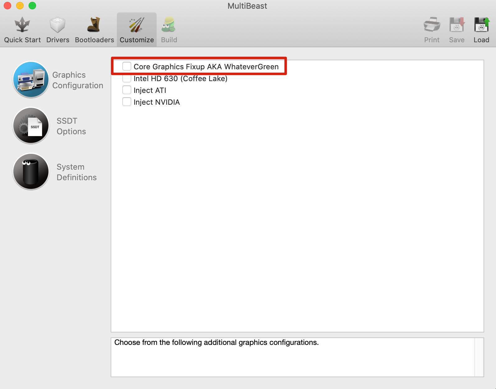
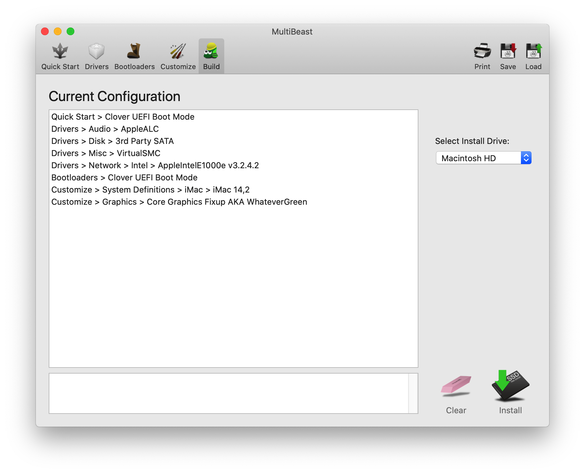

# 数据恢复后的驱动安装

从TimeMachine恢复后，发现WIFI和声卡不能用了，应该是驱动出了问题。  
在回复了了WIFI和声卡功能以后，发现使用一段时间后就会死机，画面完全冻结，必须手动关机重启。

## WIFI
将`/`mount成可写区域。  
```
sudo mount -rw /
```

用`Kext Wizard`安装`IO80211Family.kext`。  


重置驱动权限。  


打开config.plist，将CsrActiveConfig的值设定为0x67。




重启电脑。
## 声卡
用clover mount EFI，然后修改`/Volumes/EFI/EFI/CLOVER/config.plist`的以下内容。
```
<key>Audio</key>
<dict>
        <key>Inject</key>
        <string>5</string>
</dict>
```
将string改为5后重启后，发现声卡可以使用了。

相关参考资料：  
https://imac.hk/applealc-kext-use.html  
https://github.com/acidanthera/AppleALC/wiki/Supported-codecs

## 使用一段时间就死机的问题
添加了下列驱动以后，以为死机问题解决了，结果还是死机了。


最终的驱动设定如下：


后来把AppleID重新登入后，删除了find my mac里面的旧电脑信息，然后安全起见关闭了find my mac功能。  
直到目前为止没有出现死机现象。