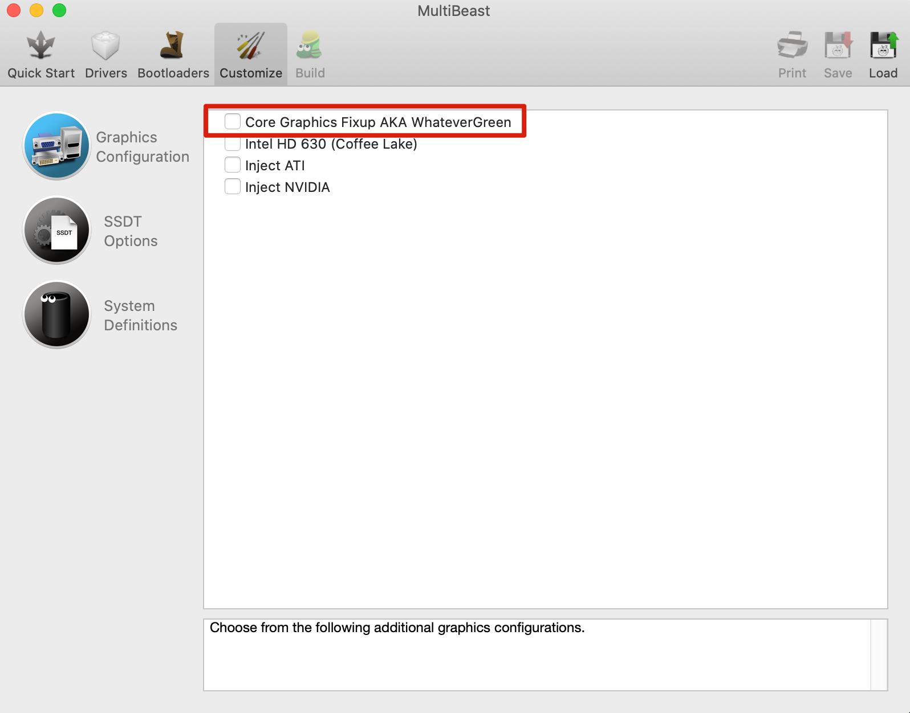
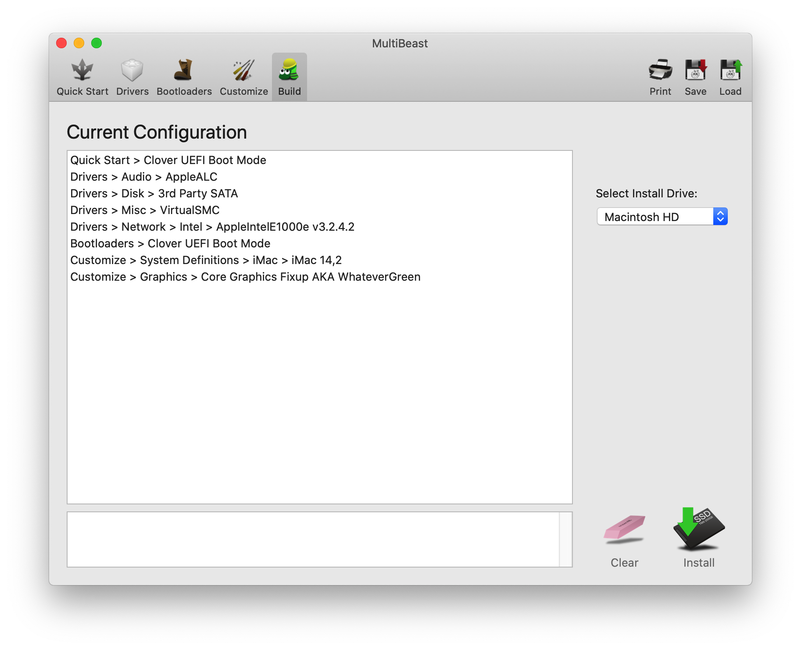

# 数据恢复后的驱动安装

从TimeMachine恢复后，发现WIFI和声卡不能用了，应该是驱动出了问题。  
在回复了了WIFI和声卡功能以后，发现使用一段时间后就会死机，画面完全冻结，必须手动关机重启。

## WIFI
将`/`mount成可写区域。  
```
sudo mount -rw /
```

删除旧驱动  
```
rm -rf /System/Library/Extensions/IO80211Family.kext
rm -rf /System/Library/Extensions/IO80211FamilyV2.kext
```


用`Kext Wizard`安装`IO80211Family.kext`后重启。

## 声卡
用clover mount EFI，然后修改`/Volumes/EFI/EFI/CLOVER/config.plist`的以下内容。
```
<key>Audio</key>
<dict>
        <key>Inject</key>
        <string>5</string>
</dict>
```
将string改为5后重启后，发现声卡可以使用了。

相关参考资料：  
https://imac.hk/applealc-kext-use.html  
https://github.com/acidanthera/AppleALC/wiki/Supported-codecs

## 使用一段时间就死机的问题
添加了下列驱动以后，以为死机问题解决了，结果还是死机了。


最终的驱动设定如下：


直到发现下面的文章才解决了司机问题。也许因为数据恢复一些VirtualSMS.kext不支持的系统文件吧。毕竟当初装黑苹果时还没有
出现VirtualSMS.kext。  
根据下面的文章，我把VirtualSMS.kext换成了以前用的FakeSMS.kext。
https://www.reddit.com/r/hackintosh/comments/awji5x/mojave_random_freeze_please_help/

并且文章中说添加了WhateverGreen，所以我决定保留WhateverGreen。

在没有用Time Machine进行数据恢复前，是没有死机问题的，因为数据恢复本身就花费了很长时间，这个过程中没有出现任何问题。