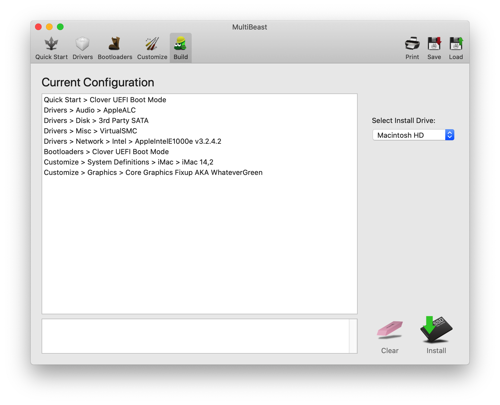

# 驱动安装

我将制作启动用的EFI所需的MultiBeast 12.3.0 Catalina Edition.zip上传到了当前的文件夹中。  
所需的选项如下：  

都选好以后执行Install。

如果之前已经有EFI盘存在，这次Install会保留以前的EFI内容，会导致启动失败。  
所以这里删除EFI盘中的EFI文件夹，重新执行Install。

然后将IO80211Family.kext拷贝到EFI/CLOVER/kext/other中，重启电脑。  
这次让电脑自动用硬盘启动，进入Clover启动，
记得确认Clover -> options -> boot args，如果nv_disable=1存在的话要删除，另外Graphic Injector menu中保持什么都没有被选中的状态。  
选中MacOS的启动盘启动(应该是默认的)。

